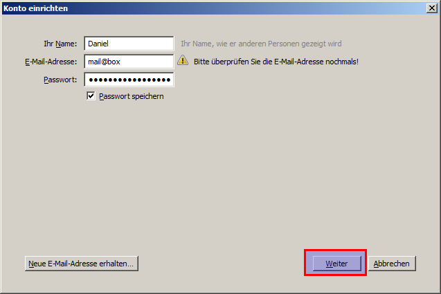

.. _email:

======
E-Mail
======

.. contents::
   :local:

*******
Webmail
*******

Auf die Webmailoberfläche zugreifen
===================================

Das Webmail ist erreichbar unter http://mail.box/

Benutze das von dir festgelegte Passwort. Siehe auch: :ref:`set_password_web_email`

Neue Nachricht schreiben
========================

Klicke auf das Symbol für eine neue Nachricht.

.. image:: images/webmail-compose.png

Adressen im "An"-Feld werden automatisch mit Einträgen aus dem Enigmabox Adressbuch vervollständigt.

Links sind drei Adressbücher zu sehen:

  * "Persönliches Adressbuch" - nicht relevant
  * "Enigmabox" - Adressen aus dem persönlichen Adressbuch (siehe: :ref:`address_book`)
  * "Enigmabox (Global)" - Adressen aus dem globalen Adressbuch

**Anhänge verschicken:** Du kannst Anhänge bis zu 100MB via Enigmabox-E-Mail verschicken.

.. _thunderbird:

***********
Thunderbird
***********

Konto erstellen
===============

Klicke in der Übersicht von Thunderbird auf "E-Mail":

Dann auf "Überspringen und meine existierende E-Mail-Adresse verwenden":

.. image:: images/thunderbird-new-account1.png

Die E-Mail-Adresse ist *mail@box* und das Passwort ist das von dir festgelegte Passwort. Siehe auch: :ref:`set_password_web_email`

Klicke dann auf "Weiter".

Wähle "POP3 (Nachrichten auf diesem Computer speichern)" aus und klicke danach auf "Manuell bearbeiten":

Passe die Einstellungen so an wie hier abgebildet:

.. image:: images/thunderbird-new-account4.png

Bestätige mit "Fertig".

Neue Nachricht schreiben
========================

Klicke auf "Verfassen":

.. image:: images/thunderbird-inbox.png

Das Nachrichtenfenster öffnet sich:

.. image:: images/thunderbird-compose.png

Die Fehlermeldung (rot markierte E-Mail-Adresse) kannst du ignorieren. Thunderbird kennt das Format der Enigmabox-E-Mail-Adresse nicht, obwohl diese perfekt dem Standard entspricht.

