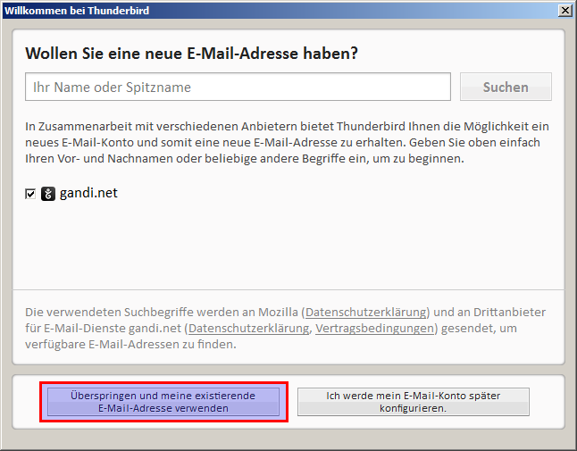

.. _email:

======
E-Mail
======

.. contents::
   :local:

*******
Webmail
*******

Auf die Webmailoberfläche zugreifen
===================================

Das Webmail ist erreichbar unter http://mail.box/

.. image:: images/webmail-login.png

Benutze das von dir festgelegte Passwort. Siehe auch: :ref:`set_password_web_email`

Neue Nachricht schreiben
========================

Klicke auf das Symbol für eine neue Nachricht.

.. image:: images/webmail-overview.png

Adressen im "An"-Feld werden automatisch mit Einträgen aus dem Enigmabox Adressbuch vervollständigt.

Links sind drei Adressbücher zu sehen:

  * "Persönliches Adressbuch" - nicht relevant
  * "Enigmabox" - Adressen aus dem persönlichen Adressbuch
  * "Enigmabox (Global)" - Adressen aus dem globalen Adressbuch

.. _thunderbird:

***********
Thunderbird
***********

Konto erstellen
===============

.. image:: images/thunderbird-overview.png

.. image:: images/thunderbird-new-account2.png

.. image:: images/thunderbird-new-account3.png

Neue Nachricht schreiben
========================

.. image:: images/thunderbird-compose.png

