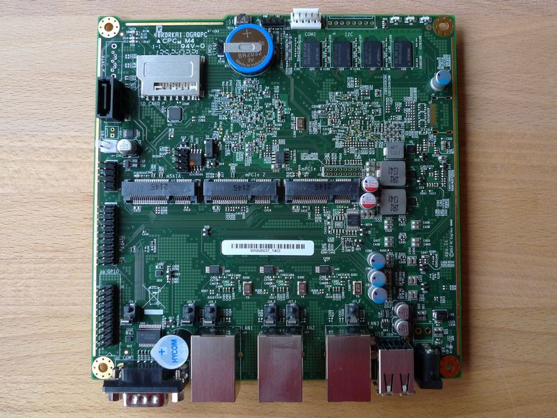
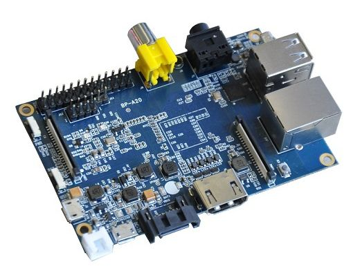

========
Hardware
========

.. contents::
   :local:

*********
Enigmabox
*********

============= =============================================
Modell:       PC Engines APU
CPU:          AMD G series T40E APU, 1 GHz 64-bit dual core
Ram:          2 GB DDR3
Speicher:     4 GB SSD
Netzwerk:     3 Gigabit Ethernet (Realtek RTL8111E)
Durchsatz:    Bis zu 40 Mbit/s verschlüsselter Datenverkehr
============= =============================================

********************
Banana Pi (Eigenbau)
********************

============= =============================================
Modell:       M1
CPU	          A20 ARM Cortex A7 Dual-Core
Ram           1GB DDR3
Speicher      4 GB SD-Karte
Netzwerk      10/100/1000 Ethernet RJ45
Durchsatz:    Bis zu 8 Mbit/s verschlüsselter Datenverkehr
============= =============================================

Anleitung zum Eigenbau: https://wiki.enigmabox.net/build-your-own
