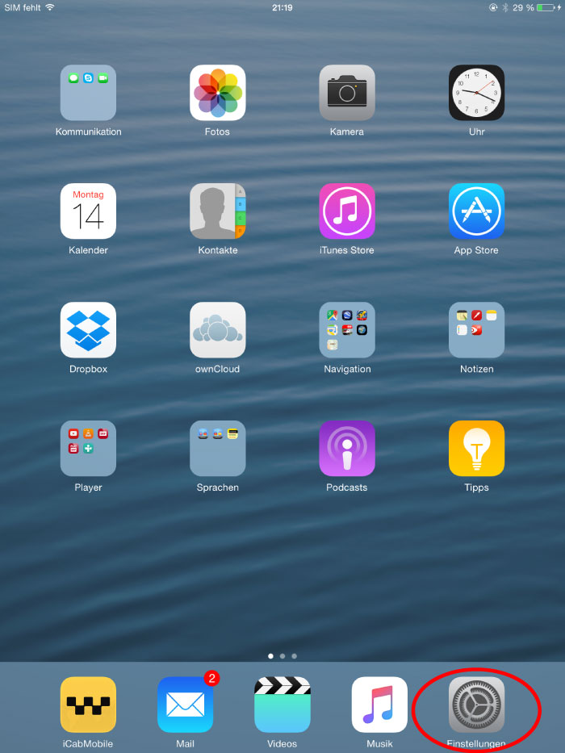
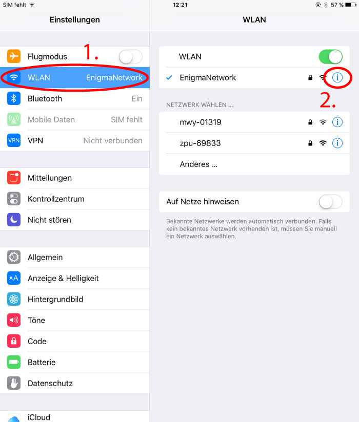

========
Internet
========

.. contents::
   :local:

.. _country_selection:

**************
Land auswählen
**************

Wähle, über welches Land du surfen willst. Also wenn du z.B. Ungarn als Land auswählst, dann verhält es sich so, als ob du wirklich grad in Ungarn in einem Internetcafé surfst. Und so mit allen Ländern.

Folgende Länder stehen zur Auswahl:

* Schweiz
* Ungarn
* Schweden
* Deutschland
* Vereinigte Daten von Amerika

.. image:: images/country-selection.png

In diesem Beispiel:

.. image:: images/country-selection-zoom.png

* Die Schweiz ist das aktuell gewählte Land.
* Falls die Verbindung zum Schweizer Server wegbricht, springt die Verbindung auf Ungarn.
* Die anderen Länder werden nicht berücksichtigt ("Inaktiv").
* Ist Ungarn nicht erreichbar, springt die Verbindung wieder auf die Schweiz.

Verändere die Reihenfolge, indem du ein Land mit der Maus an eine andere Stelle ziehst. Markiere Länder, die im Fehlerfall als Alternative berücksichtigt werden sollen.

Wie lautet meine IP? In welchem Land befinde ich mich?
======================================================

Wenn du herausfinden willst, wie die IP-Adresse lautet, die grad "von aussen" sichtbar ist und in welchem Land deine Verbindung rauskommt: Die Website http://www.whereisip.net/ gibt Auskunft darüber:

.. image:: images/whereisip.png

.. _webfilter:

**************************
Werbeblocker konfigurieren
**************************

Der Werbeblocker läuft als Proxyserver auf der Enigmabox. Sag deinem Browser, dass er sich via dieses Proxies ins Internet verbinden soll, und die Werbung wird gefiltert.

Proxyserver: *box*, Port *8888*

Firefox
=======

Proxy-Einstellungen für den Browser konfigurieren, ohne dass das ganze System davon betroffen ist:

Gehe im Firefox über den Button rechts oben im Browserfenster auf "Einstellungen":

.. image:: images/firefoxoptions.jpg

Nun klickst du zuerst auf "Erweitert" und anschliessend auf "Einstellungen...":

.. image:: images/advanced.jpg

Stelle alles so ein, wie auf dem folgenden Bild ersichtlich:

.. image:: images/proxysettingsfirefox.jpg

Windows
=======

Öffne über das Startmenü die Systemeinstellungen deines Computers:

.. image:: images/systemeinstellungen_win.jpg

Je nach eingestellter Oberfläche klick als nächstes auf "Internetoptionen":

.. image:: images/internetoptionen.jpg
   
oder auf "Netzwerk und Internet":

.. image:: images/netzwerk_undinternet.jpg
   
und anschliessend auf "Internetoptionen":

.. image:: images/internetoptionen2.jpg

Im sich darauf öffnenden Fenster wählst du zuerst "Verbindungen" und dann "LAN-Einstellungen":

.. image:: images/lan_settings.jpg

Stelle alles so ein, wie auf dem folgenden Bild ersichtlich:

.. image:: images/proxysettings.jpg

Bestätige zum Abschluss mit OK.

Kontrolliere in deinem Browser, ob du auch dort die richtigen Einstellungen gesetzt hast. Dafür gehst du z.B. im Firefox über den Button rechts oben im Browserfenster auf "Einstellungen":

.. image:: images/firefoxoptions.jpg

Nun klickst du zuerst auf "Erweitert" und anschliessend auf "Einstellungen...":

.. image:: images/advanced.jpg

* Im sich anschliessend öffnenden Fenster kontrollierst du, dass die rot umkreiste Option ausgewählt ist. Wenn nicht, wählst du sie aus und bestätigst mit OK:

.. image:: images/firefoxproxy.jpg

Mac
===

Öffne die Einstellungen deines Macs:

.. image:: images/systemeinstellungen.jpg

Klicke auf "Netzwerk":

.. image:: images/netzwerk.jpg

Wähle nun als erstes die Netzwerkverbindung aus, über welche du mit der Enigmabox verbunden bist (In diesem Fall ist das ein WLAN). Danach klickst du auf "Weitere Optionen...":

.. image:: images/weiteroptionen.jpg

Klicke im neu geöffneten Fenster zuerst auf "Proxies". Danach setzt du den Haken bei "Web-Proxy (HTTP)" und Schreibst als drittes die Adresse "box" in das entsprechende Eingabefeld. Wichtig ist auch, den Port 8888 mit anzugeben! Wiederhole den Vorgang für "Sicherer Web-Proxy (HTTPS)":

.. image:: images/proxy.jpg

Schliesse das Fenster mit OK

Kontrolliere in deinem Browser, ob du auch dort die richtigen Einstellungen gesetzt hast. Dafür gehst du z.B. im Firefox über den Button rechts oben im Browserfenster auf "Einstellungen":

.. image:: images/firefoxoptions.jpg

Nun klickst du zuerst auf "Erweitert" und anschliessend auf "Einstellungen...":

.. image:: images/advanced.jpg

Im sich anschliessend öffnenden Fenster kontrollierst du, dass die rot umkreiste Option ausgewählt ist. Wenn nicht, wählst du sie aus und bestätigst mit OK:

.. image:: images/firefoxproxy.jpg

iPad
====

Tippe auf dem Startbildschirm von iPhone oder iPad auf das Zahnrad-Symbol "Einstellungen":

Wechsle zum Bereich "WLAN" und wähle dein WLAN aus, welches mit der Enigmabox verbunden ist.
Tippe in der Zeile des Netzwerks, mit dem du verbunden bist, rechts auf das kleine blaue i im Kreis:

Im Bereich "HTTP-Proxy" stellst du den Schalter auf "Manuell". Darunter trägst du im Feld "Server" den Namen "box" ein und als Port gibst du *8888* an:

.. image::images/ProxySettingsIPad.jpg

Betätige den Home-Button, um die Einstellungen zu speichern.

**Tipp:** Um den Proxyserver wieder auszuschalten, wiederhole die obigen Schritte. In Schritt 4. tippe aber auf "Aus".

