========
Internet
========

.. contents::
   :local:

.. _country_selection:

**************
Land auswählen
**************

Wähle, über welches Land du surfen willst. Also wenn du z.B. Ungarn als Land auswählst, dann verhält es sich so, als ob du wirklich grad in Ungarn in einem Internetcafé surfst. Und so mit allen Ländern.

Folgende Länder stehen zur Auswahl:

* Schweiz
* Ungarn
* Schweden
* Deutschland
* Vereinigte Daten von Amerika

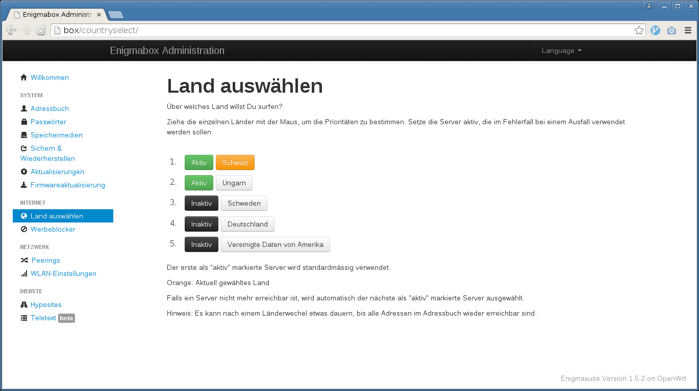

In diesem Beispiel:

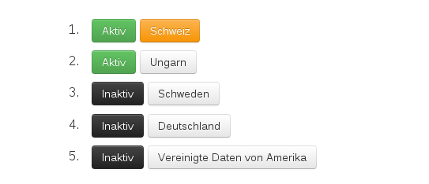

* Die Schweiz ist das aktuell gewählte Land.
* Falls die Verbindung zum Schweizer Server wegbricht, springt die Verbindung auf Ungarn.
* Die anderen Länder werden nicht berücksichtigt ("Inaktiv").
* Ist Ungarn nicht erreichbar, springt die Verbindung wieder auf die Schweiz.

Verändere die Reihenfolge, indem du ein Land mit der Maus an eine andere Stelle ziehst. Markiere Länder, die im Fehlerfall als Alternative berücksichtigt werden sollen.

Wie lautet meine IP? In welchem Land befinde ich mich?
======================================================

Wenn du herausfinden willst, wie die IP lautet, die grad "von aussen" sichtbar ist und in welchem Land deine Verbindung rauskommt: Die Website http://www.whereisip.net/ gibt Auskunft darüber:

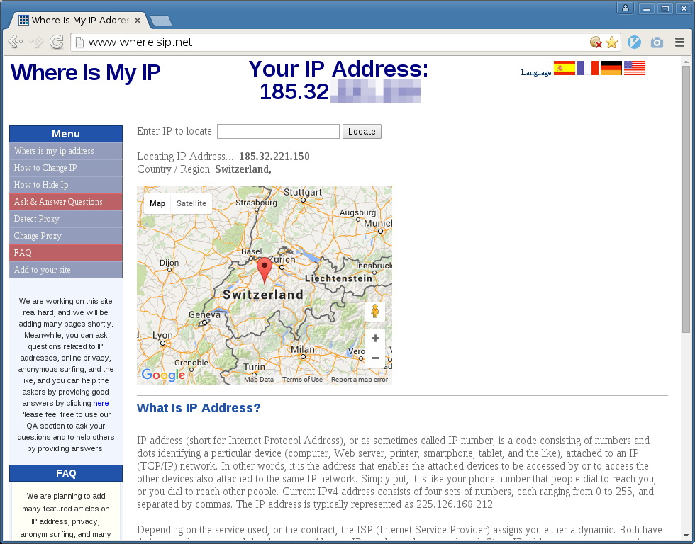

.. _webfilter:

**************************
Werbeblocker konfigurieren
**************************

Firefox
=======

Hier werde ich Ihnen am Beispiel des Firefox erläutern, wie sie die Proxy-Einstellungen nur für den Browser konfigurieren können, ohne dass das ganze System davon betroffen ist:

* Gehen Sie im Firefox über den Button rechts oben im Browserfenster auf "Einstellungen":

.. image:: images/firefoxoptions.jpg

* Nun klicken Sie zuerst auf "Erweitert" und anschliessend auf "Einstellungen...":

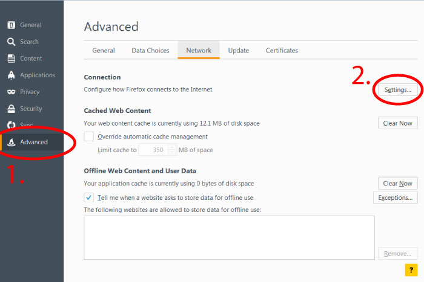

* Im sich anschliessend öffnenden Fenster stellen Sie bitte alles so ein, wie Sie es auf dem folgenden Foto sehen können:

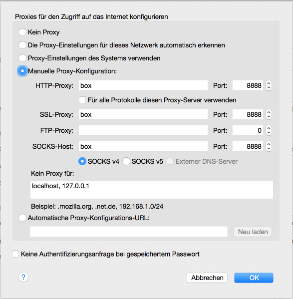

Windows
=======

* Öffnen Sie über das Startmenü die Systemeinstellungen Ihres Computers:

.. image:: images/systemeinstellungen_win.jpg

* Je nach eingestellter Oberfläche klicken Sie als Nächstes auf "Internet Optionen":

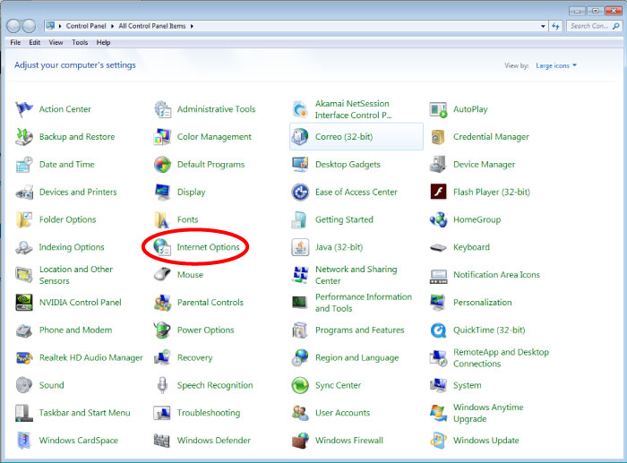
   
oder auf "Netzwerk und Internet"

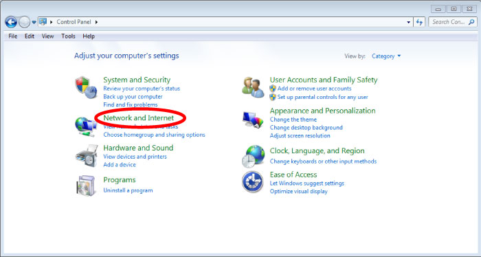
   
und anschliessend auf "Internet Optionen":

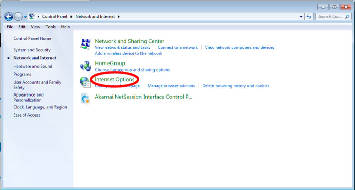

* Im sich darauf öffnenden Fenster wählen sie zuerst "Verbindungen" und dann "LAN settings":

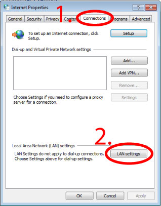

* Stellen Sie nun alles so ein, wie es auf dem nächsten Foto zu sehen ist:

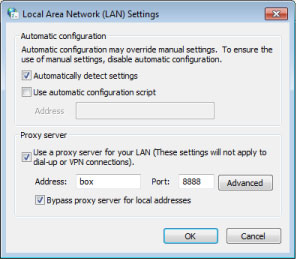

* Klicken Sie zum Abschluss auf OK.
* Kontrollieren Sie in ihrem Browser, ob sie auch dort die richtigen Einstellungen gesetzt haben. Dafür gehen Sie z.B. im Firefox über den Button rechts oben im Browserfenster auf "Einstellungen":

.. image:: images/firefoxoptions.jpg

* Nun klicken Sie zuerst auf "Erweitert" und anschliessend auf "Einstellungen...":

* Im sich anschliessend öffnenden Fenster kontrollieren Sie bitte, dass die rot umkreiste Option ausgewählt ist. Wen nicht, wählen Sie sie aus und bestätigen sie mit OK:

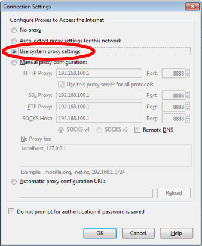

Mac
===

* Öffnen Sie die Einstellungen Ihres Macs:

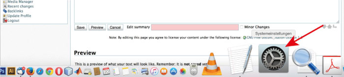

* Klicken Sie auf "Netzwerk":

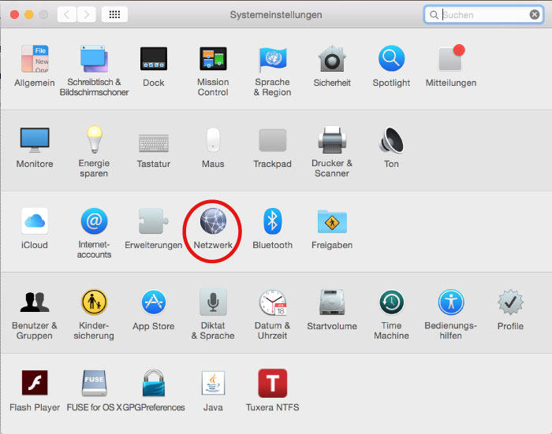

* Wählen Sie nun als Erstes die Netzwerkverbindung aus, über welche Sie mit der Enigmabox verbunden sind (In meinem Fall war das ein WLAN). Danach klicken Sie auf "Weitere Optionen...":

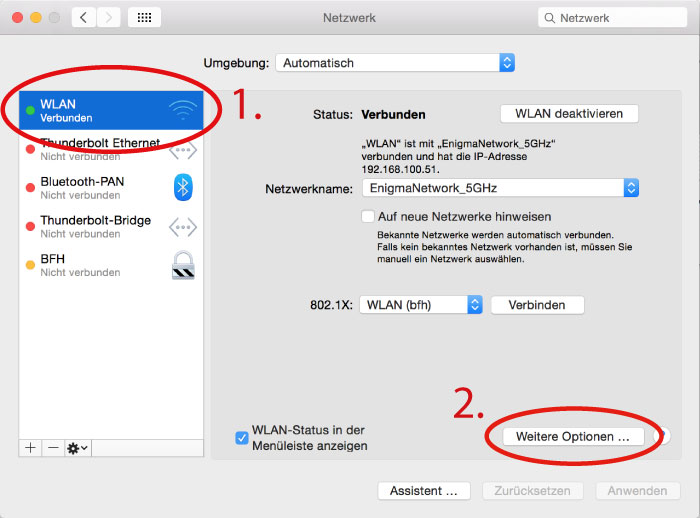

* Klicken Sie im neu geöffneten Fenster zuerst auf "Proxys". Danach setzen Sie den Haken bei "Web-Proxy (HTTP)" und Schreiben als Drittes die Adresse "box" in das entsprechende Eingabefeld. Wichtig ist auch den Port 8888 anzugeben! Wiederholen Sie den Vorgang für "Sicherer Web-Proxy (HTTPS)":

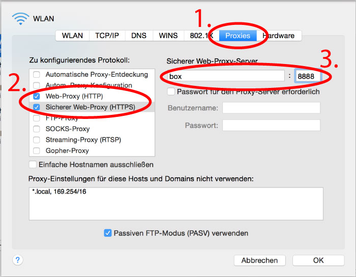

* Schliessen Sie das Fenster mit OK.\\ \\
* Kontrollieren Sie in ihrem Browser, ob sie auch dort die richtigen Einstellungen gesetzt haben. Dafür gehen Sie z.B. im Firefox über den Button rechts oben im Browserfenster auf "Einstellungen":

.. image:: images/firefoxoptions.jpg

* Nun klicken Sie zuerst auf "Erweitert" und anschliessend auf "Einstellungen...":

* Im sich anschliessend öffnenden Fenster kontrollieren Sie bitte, dass die rot umkreiste Option ausgewählt ist. Wen nicht, wählen Sie sie aus und bestätigen sie mit OK:

iPad
====

* Tippen Sie auf dem Startbildschirm von IPhone oder IPad auf das Zahnrad-Symbol "Einstellungen".
* Wechseln Sie zum Bereich "WLAN".
* Tippen Sie in der Zeile des Netzwerks, mit dem Sie verbunden sind, rechts auf den kleinen Pfeil nach rechts.
* Im Bereich "HTTP-Proxy" schalten Sie den Schalter auf "Manuell". Darunter tragen Sie die im Feld "Server" den Namen "box" ein und als Port geben sie 8888 an.
* Drücken Sie auf den Home-Knopf, um die Einstellungen zu speichern.

**Tipp**
Um den Proxyserver wieder auszuschalten, wiederholen Sie die obigen Schritte. In Schritt 4. tippen Sie aber auf "Aus". 

