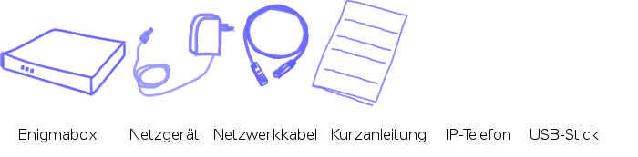
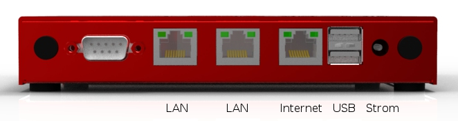
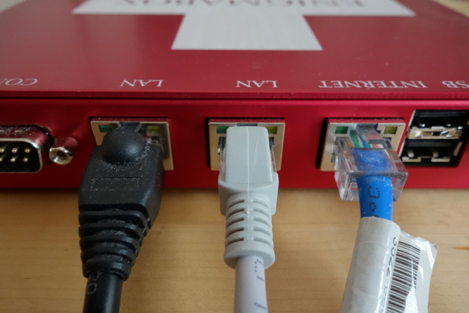
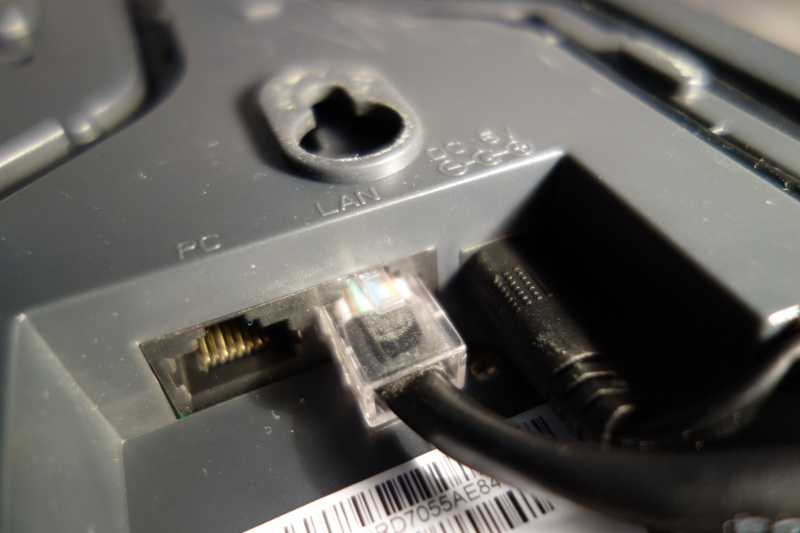
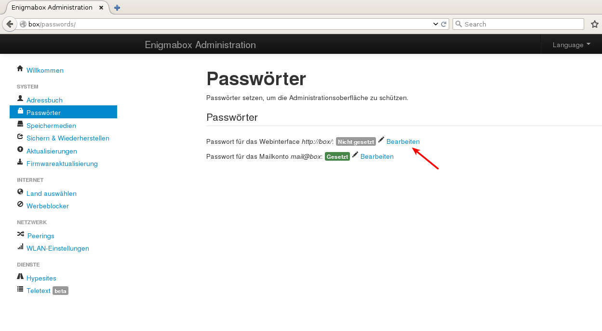

============
Schnellstart
============

************
Lieferumfang
************

***************
Der erste Start
***************

Anschliessen der Komponenten
============================

* Verbinde den Router/Modem über ein Netzwerkkabel mit der "Internet" Buchse der Enigmabox.
* Verbinde den Computer über ein Netzwerkkabel mit der "LAN" Buchse der Enigmabox.
* Verbinde das Telefon über ein Netzwerkkabel mit der "LAN" Buchse der Enigmabox.

Hier in diesem Beispiel:

| Blaues Kabel: Router/Modem
| Weisses Kabel: Computer
| Schwarzes Kabel: Telefon
| 

Wichtig: Stecke das andere Ende des schwarzen Netzwerk-Kabels in die "LAN" Buchse des Telefons.

Verbinde das Stromkabel mit der Enigmabox. Beim ersten Start kann es bis zu 5 Minuten dauern, bis die Box bereit ist. Sie bringt die Software auf den neusten Stand und konfiguriert ihren Internetzugang.

.. _webinterface:

Zugriff auf die Administrationsoberfläche
=========================================

Nach dem Start kannst du auf die Administrationsoberfläche zugreifen: http://box/ oder http://box.enigmabox.net/

Der Zugriff funktioniert nur, wenn der Computer direkt an den mit "LAN" bezeichneten Anschlüssen angeschlossen ist!
Der Anschluss "Internet" ist von aussen komplett abgeschirmt.

Setzen von Passwörtern
======================

Setze ein Passwort für die Administrationsoberfläche.

Menüpunkt "Passwörter" -> Klick auf "Bearbeiten":

.. image:: images/password-dialog.png

Gib dein gewünschtes Passwort ein. Der Benutzername ist immer "admin". Bestätigen mit "Speichern".

Danach die Änderungen mit "Änderungen anwenden" aktivieren:

.. image:: images/pw-apply.png

Wie geht es jetzt weiter?
=========================

Konfiguriere das Land, über welches du auf das Internet zugreifen willst: :ref:`country_selection`.

Füge Kontakte zum Adressbuch hinzu: :ref:`address_book`.

Richte das Telefon ein: :ref:`telephony`.

Sende und empfange E-Mails: :ref:`email`.

Führe eine Systemsicherung durch (wichtig!): :ref:`backup`. Wir halten keine Benutzerdaten auf unseren Servern. Daten auf der Enigmabox (Adressbuch, E-Mails, Bilder, Dokumente, persönliche Webseiten, Passwörter, der *cjdns Private Key*) sind auf der Enigmabox gespeichert und dort bleiben sie auch. Falls du die Daten auf deiner Enigmabox verlierst und keine Sicherung gemacht hast, bist du am Arsch.

