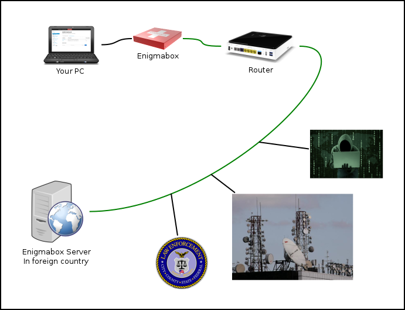
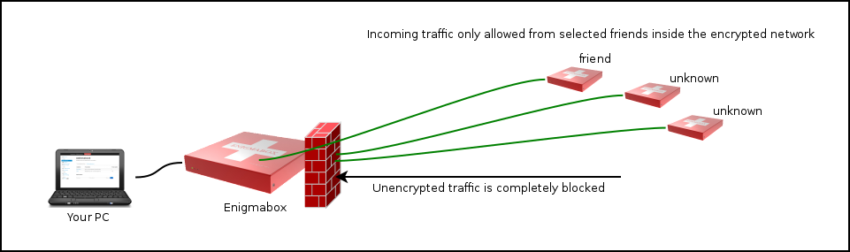
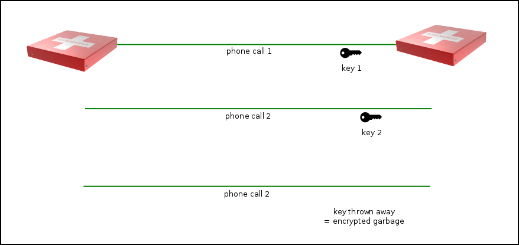
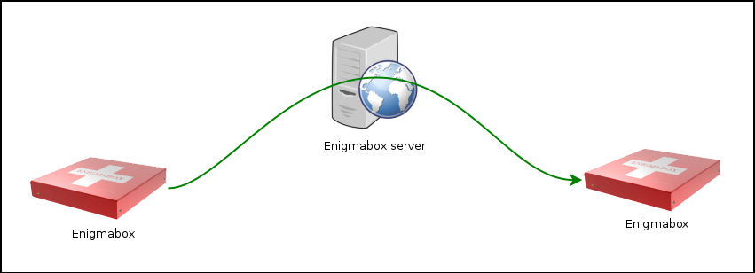
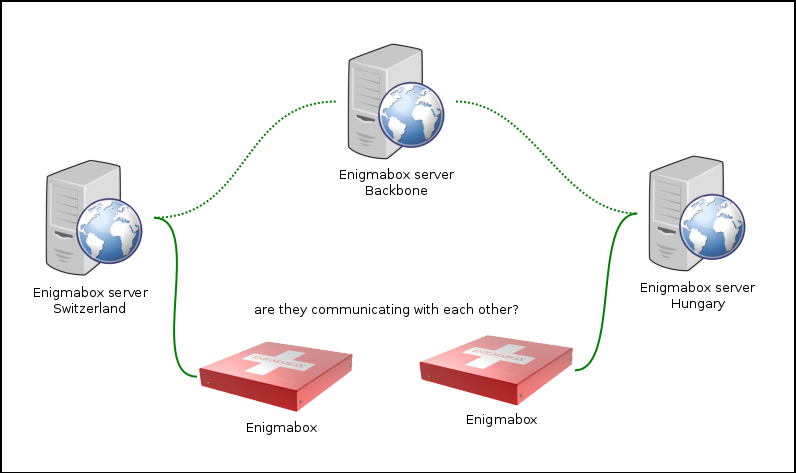
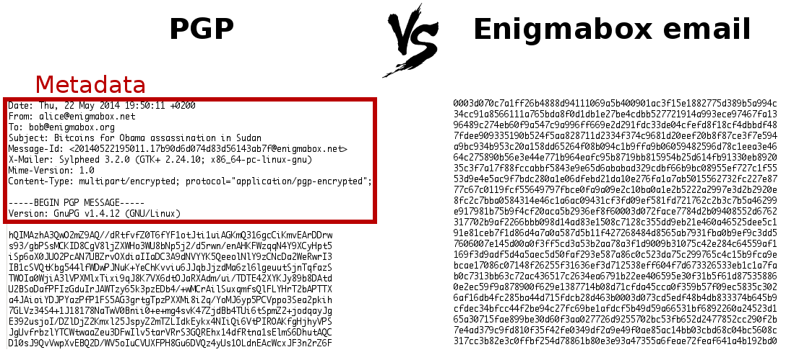
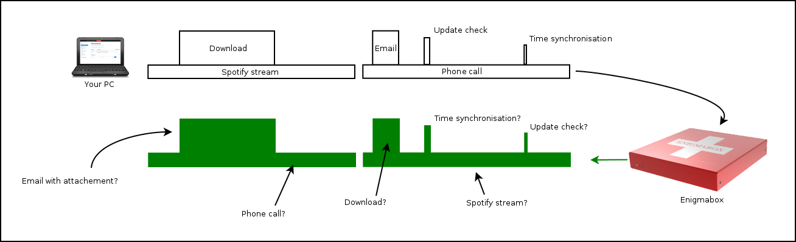
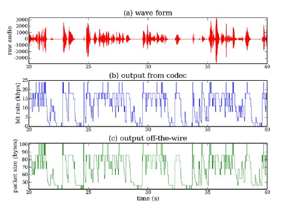
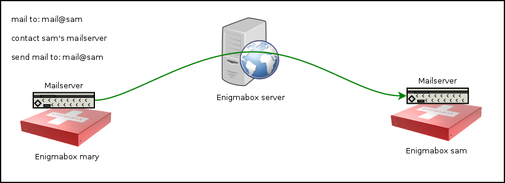
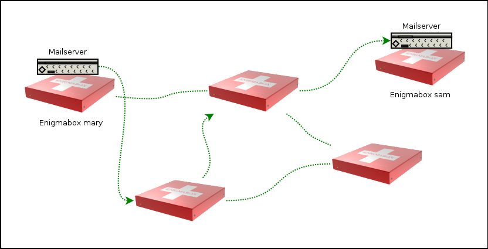

==========
Sicherheit
==========

.. contents::
   :local:

**********************************
Doppelte Umwandlung der IP-Adresse
**********************************

.. image:: images/double-NAT.png

* Viele PCs sitzen hinter einer Enigmabox.
* Viele Enigmaboxen sitzen hinter einem Server.
* Deine IP Adresse wird zweimal umgeschrieben und dein Computer ist so doppelt abgeschirmt. Von aussen sieht man nur die IP-Adresse des Servers.
* Um zu deinem Computer zu gelangen, muss ein Angreifer zum richtigen Server, dann zur richtigen Enigmabox und dann zum richtigen PC vordringen.
* Die grüne Linie ist verschlüsselter Datenverkehr, und zwar IPv4 in IPv6.

**********************************
Absicherung der Internetverbindung
**********************************

Wo auch immer du dich befindest, ob in China, im Sudan, Israel oder Deutschland; du wirst immer "vertrauenswürdiges" Internet via Enigmabox-Server empfangen, vorbei an Strafverfolgungsbehörden, schnüffelnden Geheimdiensten oder bösen Buben vom Hotelzimmer nebenan, die es auf deinen Computer abgesehen haben (so geschehen beim Darkhotel-Angriff).

Die grüne Linie ist verschlüsselter Datenverkehr, niemand kann daran etwas manipulieren.

**********************************************
Die Firewall ist standardmässig komplett dicht
**********************************************

* Regulärer, unverschlüsselter Netzwerkverkehr wird an der Enigmabox komplett blockiert.
* Nur Verbindungen innerhalb des verschlüsselten Netzwerks sind erlaubt, und auch nur von Kontakten im Adressbuch.

Lieber Angreifer: Du musst dich *im* verschlüsselten Netzwerk befinden UND in meinem Adressbuch, damit du überhaupt eine Chance hast, mich anzugreifen.

***************************
Freie, Open Source Software
***************************

Die Enigmabox ist Open Source.

Du kannst dir das Image selber kompilieren. Die Anleitung findest du in hier: :ref:`firmware`

***********************************
cjdns: Die IPv6 ist deine Identität
***********************************

Das Netzwerkprotokoll, das die Enigmabox verwendet, heisst cjdns. Bei cjdns ist die IPv6 der "Fingerabdruck", ein kryptographisches Element mit einem dazugehörigen privaten Schlüssel. Verschlüsselung ist im Protokoll fix eingebaut, unverschlüsselte Kommunikation ist gar nicht erst möglich!

.. image:: images/cjdns-privkey.png

(Für Techies: cjdns benutzt crypto_box_curve25519xsalsa20poly1305 aus der NaCl Networking and Cryptography library)

**************************
Fortgesetzte Geheimhaltung
**************************

Für jede Kommunikation wird ein temporärer Schlüssel generiert. Sobald du den Telefonhörer aufhängst, wird dieser Schlüssel verworfen und nicht einmal du selber kannst die stattgefundene Konversation jemals wieder entschlüsseln. Diese Schlüssel werden auch während eines Gesprächs ab und an gewechselt.

So, liebe NSA; ihr habt also so immens viel Rechenleistung, um damit zehntausend Septrilliarden Passwörter pro Femtosekunde zu knacken? Sagen wir, dafür braucht ihr so um die zehn Erdenjahre. Die Chancen stehen sogar so, dass ihr möglicherweise nur einen Teil des Gesprächs entschlüsseln könnt, weil ja der temporäre Schlüssel ständig mal wieder ausgewechselt wird. Für das nächste Telefonat dürft ihr wieder von vorne anfangen: Neuer Schlüssel, neues alles. Schon wieder zehn Jahre! Schad gäll?

****************************
Ende-zu-Ende Verschlüsselung
****************************

* Alle Enigmabox E-Mails sind Ende-zu-Ende verschlüsselt.
* Alle Enigmabox Telefongespräche sind Ende-zu-Ende verschlüsselt.

Die Kommunikation zwischen zwei Partnern geschieht direkt von Enigmabox zu Enigmabox. Der Server in der Mitte leitet bloss die verschlüsselten Daten weiter. Enigmabox A hat den Datenstrom für Enigmabox B verschlüsselt, und nur Enigmabox B kann diesen entschlüsseln.

******************************
Verschleierte Verbindungsdaten
******************************

Niemand kann genau sagen, ob zwei Enigmaboxen miteinander kommunizieren.

* Jede Enigmabox ist zu einem Server verbunden.
* Die Server sind untereinander verbunden.
* Der Datenverkehr von vielen Enigmaboxen fliesst über diese Server.
* Wer kommuniziert mit wem?
* Was die Strafverfolgungsbehörden sehen:

* Enigmabox A ist verbunden mit Server A.
* Enigmabox B ist verbunden mit Server B.
* Server A ist verbunden mit Server B.
* Du kannst nicht mit Sicherheit sagen, ob Enigmabox A mit Enigmabox B kommuniziert.

E-Mail header:

*************************************************************************
Alle Daten sind ein einen einzigen verschlüsselten Datenstrom eingebettet
*************************************************************************

Hier ist ein Beispiel von verschiedenen Verkehrsdaten. Ein Download benötigt viel Bandbreite während einer gewissen Zeitdauer, wogegen ein Livestream von Musik oder ein Telefongespräch nur ganz wenig Bandbreite beansprucht, dafür über einen längeren Zeitraum. Ein E-Mail senden, auf Updates überprüfen oder die Zeit synchronisieren generiert einzelne "Spitzen" im Diagramm der Bandbreitenauslastung.

Nach dem passieren der Enigmabox sieht man von den Daten nur noch deren "Silhouette". Ob du nun ein E-Mail gesendet hast, eine Website aufrufst, einen Podcast hörst oder ein Telefongespräch führst - alles sieht gleich aus, alle Daten fliessen in genau eine Richtung, nämlich zum Enigmabox-Server. Niemand kann sehen, was du genau treibst. Deine Daten fliessen auf dem Server mit anderen Datenströmen zusammen, was die Rückverfolgung erschwert.

****************************************
Konstante Bitraten bei Telefongesprächen
****************************************

    Skype's variabler Bitrate-Codec lässt Rückschlüsse auf den Inhalt zu, egal wie gut die Verschlüsselung sein mag. Sätze konnten mit einer Genauigkeit zwischen 50%-90% identifiziert werden.

Im Klartext: Wenn ich nicht spreche, werden keine Daten übermittelt (bei Codecs mit variablen Bitraten). Das macht die Kommunikation anfällig für Verkehrsdatenanalyse.

Die Enigmabox erlaubt nur Codecs mit einer fixen Bitrate, um diesem Angriff zu widerstehen.

*****************************
Keine zentralen Serverdienste
*****************************

* Auf jeder Enigmabox läuft ein Mailserver.
* Auf jeder Enigmabox läuft ein Telefonserver.
* Es wird kein zentraler Telefonie- oder Mailserver verwendet.
* Der Enigmabox-Server weiss nicht einmal, ob überhaupt ein E-Mail gesendet wurde.

*************************************************************
Im Notfall kommunizieren die Enigmaboxen direkt untereinander
*************************************************************

Das Protokoll cjdns hängt nicht von einer existierenden Internet-Infrastruktur ab. Du kannst Enigmaboxen direkt via Kabel oder Wlan verbinden. Sie formen ein Mesh-Netzwerk, welches unabhängig vom Internet läuft. Und du kannst wie gewohnt E-Mails darüber versenden und Telefongespräche führen.

Wir benutzen das Internet nur als "lange Antenne", um grosse Distanzen zu überbrücken.

*****************
Signierte Updates
*****************

Das Firmwareimage und alle Pakete sind mit einer SHA512-Prüfsumme und einem Zertifikat signiert. So ist sichergestellt, dass Updates a) nur von uns kommen können, und b) unterwegs nicht manipuliert wurden.

*********************
IP-Adressen statt DNS
*********************

Die Enigmabox verwendet zur Kommunikation mit den Servern ausschliesslich IP-Adressen, keine DNS-Namen. So kann ein Angreifer nicht via DNS Adressen fälschen und Verbindungen umleiten.

