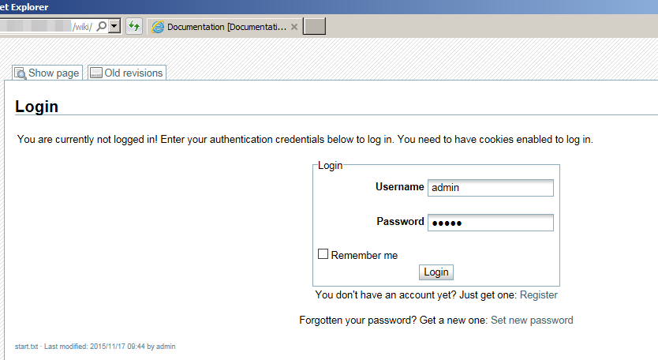

=======
Dienste
=======

.. contents::
   :local:

*********************
Eigene Website hosten
*********************

sdf

****
Wiki
****

sdf

********
Pastebin
********

sdf

********
OwnCloud
********

Initiale Einrichtung
====================

In der Administrationsoberfläche auf "Hypesite-Dienste konfigurieren" klicken:

.. image:: images/oc1.png

Webdienst OwnCloud aktivieren und dann mit "Änderungen anwenden" bestätigen:

.. image:: images/oc3.png

.. image:: images/oc4.png

Auf der Hauptseite ist jetzt "OwnCloud" anklickbar:

.. image:: images/oc5.png

Benutzername und Passwort vergeben:

.. image:: images/oc6.png

Fertig!

Echtzeitkollaboration einrichten
================================

Im OwnCloud-Menü "Apps" anwählen:

.. image:: images/oc9.png

Unter "Not enabled": "Documents" aktivieren:

.. image:: images/oc10-documents.png

"Documents" ist als neuer Menüpunkt hinzugekommen:

.. image:: images/oc11.png

Gemeinsam an einem Dokument arbeiten:

.. image:: images/oc13.png

.. image:: images/oc14.png

Externe Speicher konfigurieren
==============================

Das Menü "Speichermedien" erscheint, sobald OwnCloud aktiviert wurde:

.. image:: images/oc3.png

Name des Speichermediums eingeben, damit es aktiviert werden kann:

.. image:: images/storage1.png

Laufwerk ist eingehängt. "Änderungen anwenden":

.. image:: images/storage2.png

"Benutzen" heisst: Das Laufwerk wird eingehängt, sobald es verfügbar ist, auch nach einem Neustart.

Im OwnCloud-Menü "Apps" anwählen:

.. image:: images/oc9.png

Unter "Not enabled": "External storage support" aktivieren:

.. image:: images/storage0.png

In OwnCloud im Menü rechts "Administrator" anwählen:

.. image:: images/storage3.png

Externer Speicher hinzufügen: "Lokal", Konfiguration: Der vorher definierte Name!

.. image:: images/storage4.png

Das Laufwerk ist nun in OwnCloud als Ordner sichtbar:

.. image:: images/storage5.png

Desktop-Synchronisation einrichten
==================================

OwnCloud Desktop-Client herunterladen:

  * Windows: https://download.owncloud.com/desktop/stable/ownCloud-1.8.4.5267-setup.exe
  * Mac: https://download.owncloud.com/desktop/stable/ownCloud-1.8.4.2531.pkg

Server-Adresse eintragen:

.. image:: images/oc15.png

Fertig!

.. image:: images/oc16.png

Der gewählte Ordner wird nun mit OwnCloud synchron gehalten.

*****************
Zugriff verwalten
*****************

Firewall
========

.. image:: images/hypesites-access-overview.png

Zugriffsrechte einzelner Dienste
================================

.. image:: images/hypesite-running.png
.. image:: images/hypesites-access-friends.png
.. image:: images/hypesites-access-global.png
.. image:: images/hypesites-access-internal.png

.. image:: images/hypesites-access-overview.png
.. image:: images/hypesites-all-activated.png
.. image:: images/hypesites-enable-site.png
.. image:: images/hypesites-overview.png
.. image:: images/site-access-all.png
.. image:: images/site-access-friends.png

.. image:: images/wiki-administration.png
.. image:: images/wiki-edit-admin.png
.. image:: images/wiki-logged-in.png

.. image:: images/wiki-overview.png
.. image:: images/wiki-usermanager.png

sdf

