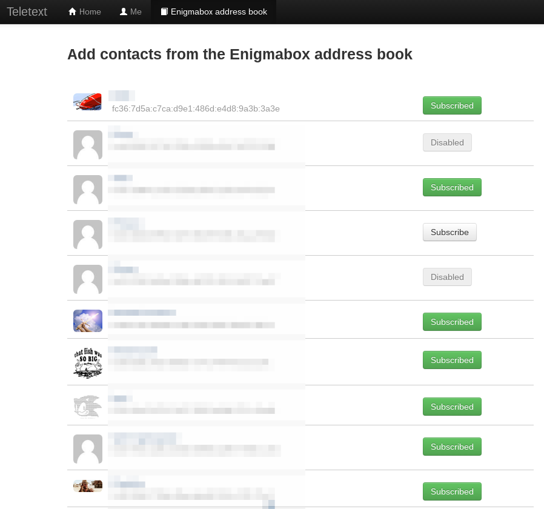

=======
Dienste
=======

.. contents::
   :local:

*****************
Zugriff verwalten
*****************

Firewall
========

Die Firewall erlaubt folgenden Zugriff auf den Webserver der Enigmabox:

.. image:: images/hypesites-access-none.png

Keiner: Kein Zugriff.

.. image:: images/hypesites-access-internal.png

Internes LAN: Nur der angeschlossene PC hat Zugriff.

.. image:: images/hypesites-access-friends.png

Nur Freunde: Kontakte aus dem Adressbuch haben Zugriff.

.. image:: images/hypesites-access-global.png

Global: Alle im verschlüsselten Netzwerk haben Zugriff.

Zugriffsrechte einzelner Dienste
================================

.. image:: images/site-access-all.png

Alle im verschlüsselten Netzwerk haben Zugriff.

.. image:: images/site-access-friends.png

Kontakte aus dem Adressbuch haben Zugriff.

.. image:: images/site-access-specific.png

Erlaube einzelnen IPv6-Adressen den Zugriff auf einen Dienst.

.. _hosting:

*********************
Eigene Website hosten
*********************

.. image:: images/hypesites-overview.png

Hypesites sind Websites innerhalb des verschlüsselten Netzwerks. Auf der Enigmabox läuft ein Webserver, und jeder kann seine eigene Website für andere Enigmabox-Benutzer zur Verfügung stellen.

Dienst aktivieren
=================

In der Administrationsoberfläche auf "Hypesite-Dienste konfigurieren" klicken:

Dann "Eigene Website" aktivieren:

.. image:: images/hypesites-enable-site.png

Danach die Änderungen mit "Änderungen anwenden" aktivieren:

.. image:: images/apply-changes.png

Die eigene Website läuft und du kannst sie über die URL, die jetzt rechts eingeblendet wird, aufrufen.

Dateien mit SFTP hochladen
==========================

**WinSCP herunterladen:** http://winscp.net/download/winscp574setup.exe

**Mit der Enigmabox verbinden:**

Für das Passwort, siehe :ref:`set_password_ssh`

Verbinden, Passwort eingeben.

**HTML-Dateien hochladen:**

Das Verzeichnis des Webservers ist */srv/www/*

Editiere die index.html, lade beliebige Dateien hoch. PHP wird unterstützt.

.. image:: images/hypesite-running.png

.. _wiki:

****
Wiki
****

Ein Wiki ermöglicht kollaboratives Arbeiten an Projekten, zur Dokumentation oder zur Ideenfindung.

Dienst aktivieren
=================

In der Administrationsoberfläche auf "Hypesite-Dienste konfigurieren" klicken:

Dann "Wiki" aktivieren:

.. image:: images/enable-wiki.png

Danach die Änderungen mit "Änderungen anwenden" aktivieren:

.. image:: images/apply-changes.png

Das Wiki läuft und du kannst es über die URL, die jetzt rechts eingeblendet wird, aufrufen.

Passwort vom Admin-Account ändern
=================================

Klicke im Menü unten links auf "Login":

.. image:: images/wiki-overview.png

Logge dich ein, Benutzer: *admin*, Passwort: *admin*.

.. image:: images/wiki-login.png

Gehe zur Wiki-Administration:

Klicke auf "User Manager":

.. image:: images/wiki-administration.png

Wähle den Benutzer "admin" aus:

.. image:: images/wiki-usermanager.png

Setze ein starkes Passwort und klicke danach auf "Save Changes".

Das Wiki ist jetzt konfiguriert und einsatzbereit. Für weitere Informationen, konsultiere die DokuWiki Dokumentation: https://www.dokuwiki.org/wiki:dokuwiki

********
Pastebin
********

Ein Pastebin ist dazu da, um lange und kurze Texte schnell und einfach mit anderen zu teilen. Alles, was du tun musst, ist, den Text in ein Feld einfügen (Paste), und dann den Link verteilen. Der Pastebin, der auf der Enigmabox mitgeliefert wird, unterstützt verschlüsselte Pastes.

In der Administrationsoberfläche auf "Hypesite-Dienste konfigurieren" klicken:

Dann "Pastebin" aktivieren:

.. image:: images/enable-pastebin.png

Danach die Änderungen mit "Änderungen anwenden" aktivieren:

.. image:: images/apply-changes.png

Der Pastebin läuft und du kannst ihn über die URL, die jetzt rechts eingeblendet wird, aufrufen.

.. _owncloud:

********
OwnCloud
********

OwnCloud ermöglicht es, Dateien aller Art mit anderen zu teilen, Dateien auf mehreren Rechnern synchron zu halten und gemeinsam an Dokumenten zu arbeiten. Auf der Enigmabox ist OwnCloud so eingebunden, dass sämtliche Kommunikation verschlüsselt ist, das Teilen mit anderen funktioniert also nur innerhalb des Netzwerks.

Initiale Einrichtung
====================

In der Administrationsoberfläche auf "Hypesite-Dienste konfigurieren" klicken:

Webdienst OwnCloud aktivieren und dann mit "Änderungen anwenden" bestätigen:

.. image:: images/oc3.png

.. image:: images/oc4.png

Auf der Hauptseite ist jetzt "OwnCloud" anklickbar:

.. image:: images/oc5.png

Benutzername und Passwort vergeben:

.. image:: images/oc6.png

Fertig!

.. image:: images/oc7.png

.. _realtime_collaboration:

Echtzeitkollaboration einrichten
================================

Im OwnCloud-Menü "Apps" anwählen:

.. image:: images/oc9.png

Unter "Not enabled": "Documents" aktivieren:

.. image:: images/oc10-documents.png

"Documents" ist als neuer Menüpunkt hinzugekommen:

Gemeinsam an einem Dokument arbeiten:

.. image:: images/oc12.png

.. image:: images/oc13.png

.. image:: images/oc14.png

Externe Speicher konfigurieren
==============================

Das Menü "Speichermedien" erscheint, sobald OwnCloud aktiviert wurde:

.. image:: images/oc3.png

Name des Speichermediums eingeben, damit es aktiviert werden kann:

Laufwerk ist eingehängt. "Änderungen anwenden":

.. image:: images/storage2.png

"Benutzen" heisst: Das Laufwerk wird eingehängt, sobald es verfügbar ist, auch nach einem Neustart.

Im OwnCloud-Menü "Apps" anwählen:

.. image:: images/oc9.png

Unter "Not enabled": "External storage support" aktivieren:

In OwnCloud im Menü rechts "Administrator" anwählen:

.. image:: images/storage3.png

Externer Speicher hinzufügen: "Lokal", Konfiguration: Der vorher definierte Name!

Das Laufwerk ist nun in OwnCloud als Ordner sichtbar:

Desktop-Synchronisation einrichten
==================================

OwnCloud Desktop-Client herunterladen:

  * Windows: https://download.owncloud.com/desktop/stable/ownCloud-1.8.4.5267-setup.exe
  * Mac: https://download.owncloud.com/desktop/stable/ownCloud-1.8.4.2531.pkg

Server-Adresse eintragen:

.. image:: images/oc15.png

Fertig!

.. image:: images/oc16.png

Der gewählte Ordner wird nun mit OwnCloud synchron gehalten.

********
Teletext
********

Teletext ist ein Nachbau des Kurznachrichtendienstes Twitter. Allerdings dezentral und verschlüsselt, wie jeder Dienst auf der Enigmabox. Mit Teletext können Nachrichten bis zu 256 Zeichen in Echtzeit zu anderen Enigmaboxen gesendet werden. Die Empfänger können auswählen, von welchem Sender sie Nachrichten empfangen möchten. Der Sender kann selbst bestimmen, ob seine Abonnenten und seine abonnierten Kanäle von anderen Anwendern sichtbar sind.

So geht's:

Da Teletext eine öffentliche Schnittstelle für alle innerhalb des verschlüsselten Netzwerks bereitstellt, ist das Programm standardmässig deaktiviert und muss manuell in der Administrationsoberfläche eingeschaltet werden. Also einschalten unter http://box/teletext/.

Teletext ist nun aktiviert und erreichbar: http://text.box/.

Profil ausfüllen
================

* **Username:** Der Benutzername, der im Profil angezeigt wird.
* **Bio:** Eine kurze Beschreibung über dich oder über das, was dieser Kanal darstellt.
* **Profile image:** Lade ein Profilbild hoch, welches neben jedem Telegramm dargestellt wird.
* **Show subscribers:** Legt fest, ob andere deine Abonnenten sehen können.
* **Show subscriptions:** Legt fest, ob andere deine abonnierten Kanäle sehen können.

Profilansicht
=============

So erscheint deine Telegrammseite für andere Besucher.

Kontakte aus dem Enigmabox-Adressbuch hinzufügen
================================================

Falls Kontakte aus deinem Adressbuch Teletext bei sich aktiviert haben, kannst du dich zu ihnen abonnieren.

Die Telegramme werden nun abgerufen und lokal auf Deiner Enigmabox gespeichert. Mit einem Klick auf den Sendernamen im Telegramm können die Details angezeigt werden. Mit "Retransmit" wird das Telegramm an deine Abonnenten weitergereicht.

Die Timeline
============

Die Timeline stellt die Telegramme aller abonnierten Kanäle dar. Der neuste Beitrag ist zuoberst.

Im Textfeld ganz oben kannst du dein Telegramm verfassen, welches dann an alle Abonnenten gesendet wird.

Erwähnungen
===========

Drücke "@" und wähle einen Empfänger aus der Liste aus, um ein Telegramm an ihn zu schicken, auch wenn dieser deinen Kanal nicht abonniert hat. Der Benutzername wird verlinkt und der Empfänger per E-Mail benachrichtigt.

News Super Agency
=================

http://text.box/fc80:56b5:b0ac:0c35:8e73:c9d1:5029:a6f2

Der Einstiegspunkt für neue Teletext-Anwender mit leeren Adressbüchern. Dieser Kanal berichtet über Geschehnisse rund um Überwachung und Datenschutz.

Wenn du dich zu ihm abonnierst, wirst du in der "Subscribers"-Liste angezeigt und kannst so mit anderen Kanälen in Kontakt treten.

Der Teletext ermöglicht den Netzbürgern, sich innerhalb des verschlüsselten Netzwerks zu finden. Sie können neue Kontakte zum Enigmabox Adressbuch hinzufügen und dann verschlüsselt telefonieren und E-Mails austauschen.

*****************
Portweiterleitung
*****************

Die Portweiterleitung erlaubt es, einen beliebigen Port im cjdns-Netzwerk an einen Rechner im LAN weiterzuleiten. So kann man z.B. eine Remotedesktopverbindung einrichten, oder Gameserver innerhalb von Hyperboria hosten. Im folgenden Beispiel verbindet [IPv6]:5900 zum VNC-Server meines Laptops (192.168.100.52:5900).

Es werden immer beide - TCP und UDP-Ports - weitergeleitet.

Der Status zeigt an, ob ein Dienst von der Box erreichbar ist. Diese Statusanzeige funktioniert aber nur bei TCP-Diensten.

Die Zugriffsrechte können ähnlich granular vergeben werden wie bei den anderen Diensten.

.. image:: images/portforwarding-service.png

Portweiterleitung erstellen
===========================

.. image:: images/portforwarding-create.png

**Port:** Auf welchem Port auf der IPv6 der Enigmabox soll der Dienst lauschen?

**Zielgerät:** Rechner, auf dem der Dienst läuft

**Zielport:** Eigentlicher Port des Dienstes

Port und Zielport müssen nicht übereinstimmen; "Port" kann frei gewählt werden. Ausnahmen sind bereits belegte Ports wie 22, 25, 80, 110, 143, 3838, 5060.

**Beschreibung (optional):** Eine kurze Beschreibung des Dienstes.

Danach auf "Speichern" klicken und die Zugriffsrechte vergeben.

.. note:: Wichtig: Der Port ist erst erreichbar, wenn die Zugriffsrechte vergeben wurden! Auf einen frisch erstellten Port hat noch niemand Zugriff.

In der Administrationsoberfläche werden die aktiven Portweiterleitungen angezeigt:

.. image:: images/portforwarding-status.png

