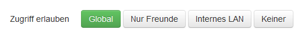

=======
Dienste
=======

.. contents::
   :local:

*****************
Zugriff verwalten
*****************

Firewall
========

Die Firewall erlaubt folgenden Zugriff auf den Webserver der Enigmabox:

.. image:: images/hypesites-access-none.png

Keiner: Kein Zugriff.

Internes LAN: Nur der angeschlossene PC hat Zugriff.

Nur Freunde: Kontakte aus dem Adressbuch haben Zugriff.

Global: Alle im verschlüsselten Netzwerk haben Zugriff.

Zugriffsrechte einzelner Dienste
================================

.. image:: images/site-access-all.png

Alle im verschlüsselten Netzwerk haben Zugriff.

Kontakte aus dem Adressbuch haben Zugriff.

.. image:: images/site-access-specific.png

Erlaube einzelnen IPv6-Adressen den Zugriff auf einen Dienst.

*********************
Eigene Website hosten
*********************

Hypesites sind Websites innerhalb des verschlüsselten Netzwerks. Auf der Enigmabox läuft ein Webserver, und jeder kann seine eigene Website für andere Enigmabox-Benutzer zur Verfügung stellen.

Dienst aktivieren
=================

In der Administrationsoberfläche auf "Hypesite-Dienste konfigurieren" klicken:

.. image:: images/oc1.png

Dann "Eigene Website" aktivieren:

.. image:: images/hypesites-enable-site.png

Danach die Änderungen mit "Änderungen anwenden" aktivieren:

.. image:: images/apply-changes.png

Die eigene Website läuft und du kannst sie über die URL, die jetzt rechts eingeblendet wird, aufrufen.

Dateien mit SFTP hochladen
==========================

**WinSCP herunterladen:** http://winscp.net/download/winscp574setup.exe

**Mit der Enigmabox verbinden:**

.. image:: images/sftp.png

Für das Passwort, siehe :ref:`set_password_ssh`

.. image:: images/enter-pw.png

Verbinden, Passwort eingeben.

**HTML-Dateien hochladen:**

Das Verzeichnis des Webservers ist */srv/www/*

Editiere die index.html, lade beliebige Dateien hoch. PHP wird unterstützt.

****
Wiki
****

Dienst aktivieren
=================

In der Administrationsoberfläche auf "Hypesite-Dienste konfigurieren" klicken:

.. image:: images/configure-hypesite-services.png

Dann "Wiki" aktivieren:

.. image:: images/enable-wiki.png

Danach die Änderungen mit "Änderungen anwenden" aktivieren:

.. image:: images/apply-changes.png

Das Wiki läuft und du kannst es über die URL, die jetzt rechts eingeblendet wird, aufrufen.

Passwort vom Admin-Account ändern
=================================

Klicke im Menü unten links auf "Login":

.. image:: images/wiki-overview.png

Logge dich ein, Benutzer: *admin*, Passwort: *admin*.

.. image:: images/wiki-login.png

Gehe zur Wiki-Administration:

.. image:: images/wiki-logged-in.png

Klicke auf "User Manager":

.. image:: images/wiki-administration.png

Wähle den Benutzer "admin" aus:

.. image:: images/wiki-usermanager.png

Setze ein starkes Passwort und klicke danach auf "Save Changes".

.. image:: images/wiki-edit-admin.png

Das Wiki ist jetzt konfiguriert und einsatzbereit. Für weitere Informationen, konsultiere die DokuWiki Dokumentation: https://www.dokuwiki.org/wiki:dokuwiki

********
Pastebin
********

sdf

********
OwnCloud
********

Initiale Einrichtung
====================

In der Administrationsoberfläche auf "Hypesite-Dienste konfigurieren" klicken:

.. image:: images/oc1.png

Webdienst OwnCloud aktivieren und dann mit "Änderungen anwenden" bestätigen:

.. image:: images/oc3.png

Auf der Hauptseite ist jetzt "OwnCloud" anklickbar:

Benutzername und Passwort vergeben:

.. image:: images/oc6.png

Fertig!

.. image:: images/oc7.png

Echtzeitkollaboration einrichten
================================

Im OwnCloud-Menü "Apps" anwählen:

.. image:: images/oc9.png

Unter "Not enabled": "Documents" aktivieren:

"Documents" ist als neuer Menüpunkt hinzugekommen:

.. image:: images/oc11.png

Gemeinsam an einem Dokument arbeiten:

.. image:: images/oc12.png

.. image:: images/oc13.png

.. image:: images/oc14.png

Externe Speicher konfigurieren
==============================

Das Menü "Speichermedien" erscheint, sobald OwnCloud aktiviert wurde:

.. image:: images/oc3.png

Name des Speichermediums eingeben, damit es aktiviert werden kann:

.. image:: images/storage1.png

Laufwerk ist eingehängt. "Änderungen anwenden":

"Benutzen" heisst: Das Laufwerk wird eingehängt, sobald es verfügbar ist, auch nach einem Neustart.

Im OwnCloud-Menü "Apps" anwählen:

.. image:: images/oc9.png

Unter "Not enabled": "External storage support" aktivieren:

.. image:: images/storage0.png

In OwnCloud im Menü rechts "Administrator" anwählen:

.. image:: images/storage3.png

Externer Speicher hinzufügen: "Lokal", Konfiguration: Der vorher definierte Name!

.. image:: images/storage4.png

Das Laufwerk ist nun in OwnCloud als Ordner sichtbar:

.. image:: images/storage5.png

Desktop-Synchronisation einrichten
==================================

OwnCloud Desktop-Client herunterladen:

  * Windows: https://download.owncloud.com/desktop/stable/ownCloud-1.8.4.5267-setup.exe
  * Mac: https://download.owncloud.com/desktop/stable/ownCloud-1.8.4.2531.pkg

Server-Adresse eintragen:

Fertig!

Der gewählte Ordner wird nun mit OwnCloud synchron gehalten.

