======
System
======

.. contents::
   :local:

.. _address_book:

*******************
Adressen verwalten
*******************

Das Adressbuch ist der Dreh- und Angelpunkt für die Kontaktverwaltung der Enigmabox. Die IPv6-Adresse wird zufällig generiert und dient als eindeutige Identifizierung im Netzwerk.

(Für technische Details, siehe :ref:`tech`).

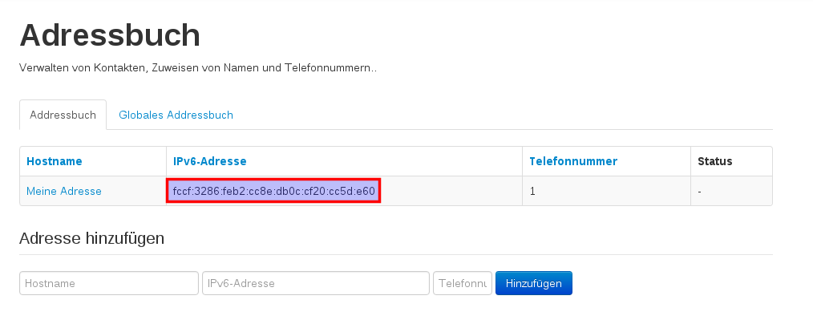

Die IPv6 ist deine Telefonnummer. Die Enigmaboxen identifizieren sich nur anhand dieser IPv6.

Da es aber mühsam wäre, diese lange Folge von Zahlen und Buchstaben jedesmal am Telefon einzugeben, weist du der IPv6 eine Kurznummer für das Telefon, also eine Telefonnummer zu.

Kontakt hinzufügen
==================

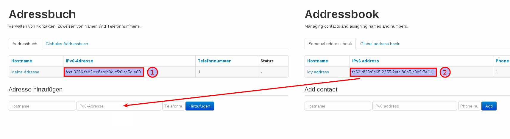

Trage die IPv6 deines Kontakts (2) in das Feld "IPv6-Adresse" ein. Trage einen beliebigen Namen (Hostname) und eine Telefonnummer dazu ein.

Teile deine IPv6 (1) ("Meine Adresse") deinem Gegenüber mit. Er wiederholt den Vorgang.

Sobald die IPs gegenseitig im Adressbuch eingetragen sind, könnt ihr euch anrufen.

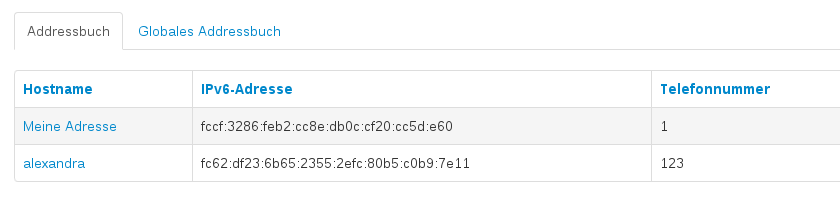

Beispiel:

#. Meine IP ist "fccf:3286:feb2:cc8e:db0c:cf20:cc5d:e60"
#. Ich wähle die Telefonnummer "123"
#. Das Telefon ruft die IP "fc62:df23:6b65:2355:2efc:80b5:c0b9:7e11" (alexandra) an

Der Hostname (alexandra) wird für die E-Mail Adresse verwendet. Die E-Mail Adresse von alexandra ist in diesem Beispiel "mail@alexandra".

Wie man E-Mails sendet und empfängt, steht unter :ref:`email`.

**********************
Das globale Adressbuch
**********************

Das globale Adressbuch ist ein Verzeichnis, in dem jeder seine Adresse publizieren kann, wenn er möchte. Der Vorteil: Der gegenseitige Adressaustausch entfällt. Das ist z.B. bei einem Verkaufsladen von Vorteil; der Inhaber publiziert seine Nummer im globalen Adressbuch und ist so sofort für potentielle Kunden erreichbar.

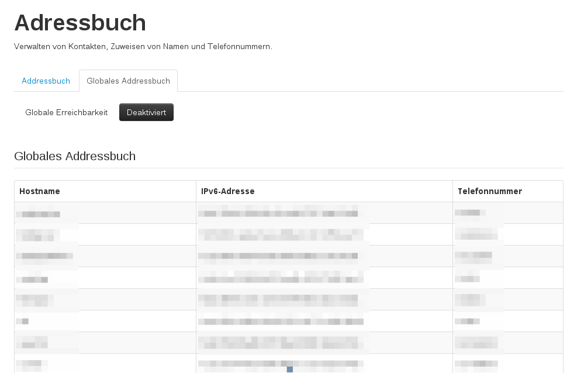

Damit man überhaupt für alle erreichbar ist, muss dafür die Firewall freigeschaltet werden. Das wird über die *globale Erreichbarkeit* geregelt. Standardmässig ist das ausgeschaltet.

Globale Erreichbarkeit aktivieren
=================================

Klick im globalen Adressbuch auf den schwarzen Schalter "Deaktiviert":

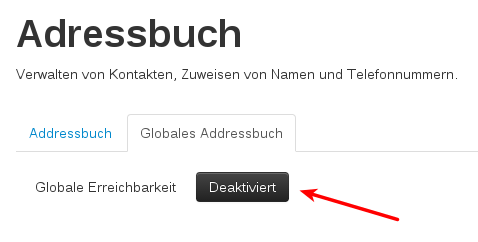

Die Firewall wird für alle im verschlüsselten Netzwerk freigeschaltet und der Knopf hat sich geändert in "Ich bin global erreichbar":

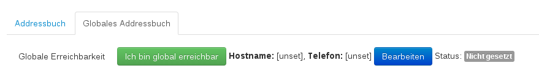

Bestätige diese Änderung mit "Änderungen anwenden":

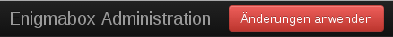

Eigene Adresse im globalen Adressbuch publizieren
=================================================

Klicke auf den blauen Knopf "Bearbeiten":

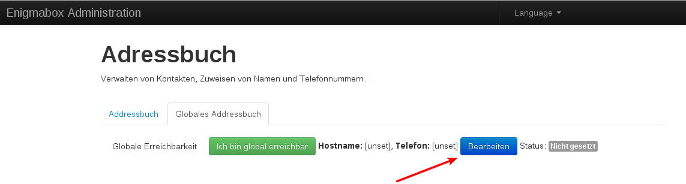

Eine Eingabemaske erscheint:

.. image:: images/ga-enter-number.png

Wähle einen Namen und eine Telefonnummer, unter der du erreichbar sein willst. Telefonnummern im globalen Adressbuch fangen immer mit "01" an (wird bei der Eingabe automatisch vorangestellt).

Bestätige deine Eingabe mit "Speichern".

Der Status ist nun *ausstehend*:

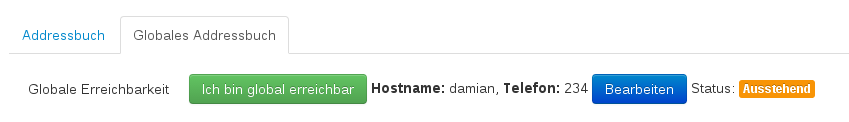

Alle paar Stunden wird das globale Adressbuch synchronisiert und neue Einträge werden publiziert.

Wenn alles geklappt hat, ist der Status grün *bestätigt*:

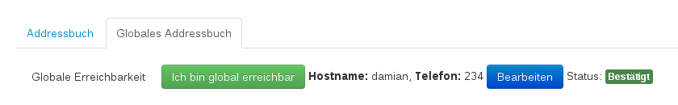

Ist die Telefonnummer oder der Hostname schon besetzt, wird *zurückgewiesen*:

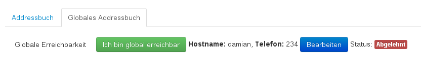

In diesem Fall eine andere Nummer/Hostname verwenden.

.. _set_password:

**********
Passwörter
**********

Passwort für die Administrationsoberfläche
==========================================

| **Benutzer:** admin
| **Passwort:** *[keins]* oder das von dir gesetzte Passwort (siehe :ref:`set_password_web_email`)
|

Passwort für das E-Mail Konto
=============================

| **Benutzer:** mail@box
| **Passwort:** *[Zufallspasswort]* oder das von dir gesetzte Passwort (siehe :ref:`set_password_web_email`)
|

Passwort für das Telefon
========================

| **Benutzer:** 100
| **Passwort:** 100
|

Passwort für den SSH-Zugang
===========================

| **Benutzer:** root
| **Passwort:** *Zufallspasswort*, ersichtlich auf der Übersichtsseite der Administrationsoberfläche (siehe :ref:`webinterface`)
|

.. _set_password_web_email:

Passwort für die Administrationsoberfläche oder das E-Mail Konto setzen
=======================================================================

Klicke unter Passwörter auf "Bearbeiten" für die Administrationsoberfläche oder für das E-Mail Konto:

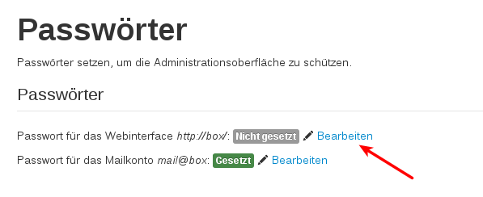

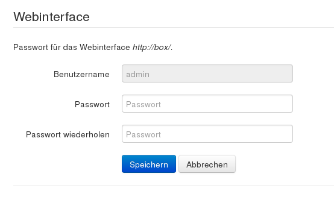

Gib dein gewünschtes Passwort ein.

Für die Administrationsoberfläche lautet der Benutzername "admin".
Der Benutzername für das E-Mail Konto heisst "mail@box".

Bestätigen mit "Speichern".

Danach die Änderungen mit "Änderungen anwenden" aktivieren:

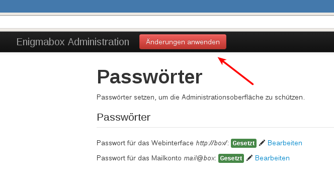

*********************
Passwort zurücksetzen
*********************

Falls du dein Passwort für die Administrationsoberfläche vergessen hast und nicht mehr darauf zugreifen kannst:

* Stelle sicher, dass die Enigmabox eingeschaltet ist
* Stecke den mitgelieferten USB-Stick ein
* Warte eine Minute
* Entferne den USB-Stick
* Greif auf die Administrationsoberfläche zu

Auf dem USB-Stick ist das SSL-Zertifikat für die Aboverwaltung gespeichert. Es dient auch dazu, Passwörter zurückzusetzen. Die Enigmabox prüft, ob das Zertifikat auf dem Stick dasselbe ist wie im System und setzt dann das Passwort der Administrationsoberfläche zurück.

.. _backup:

********************************
Eine Systemsicherung durchführen
********************************

Halte einen USB-Stick bereit, der gross genug ist, um alle Daten zu sichern (4GB empfohlen). Verwende NICHT den mitgelieferten USB-Stick! Der wird zum zurücksetzen des Passwortes verwendet.

Klick im Menü "Sichern & Wiederherstellen" auf "Vollständiges System":

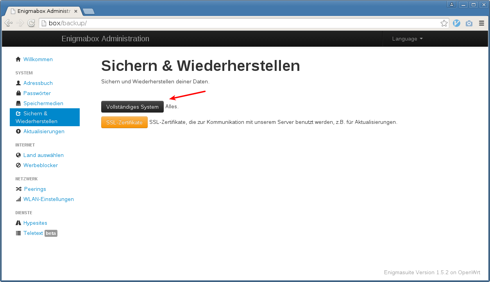

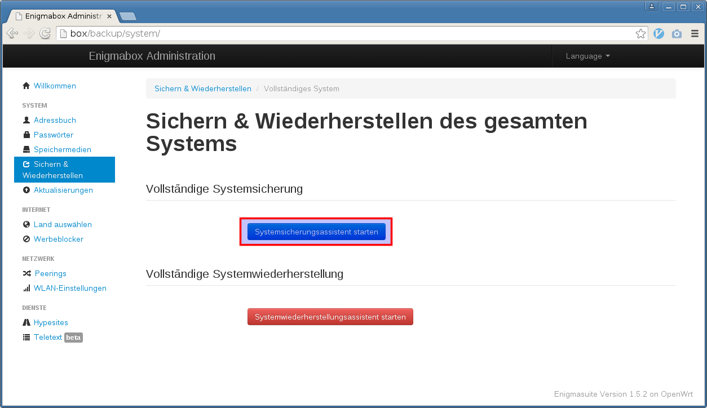

Starte den Systemsicherungsassistenten.

Stecke den USB-Stick ein. Er wird geprüft, ob genügend Platz für die Sicherung vorhanden ist.

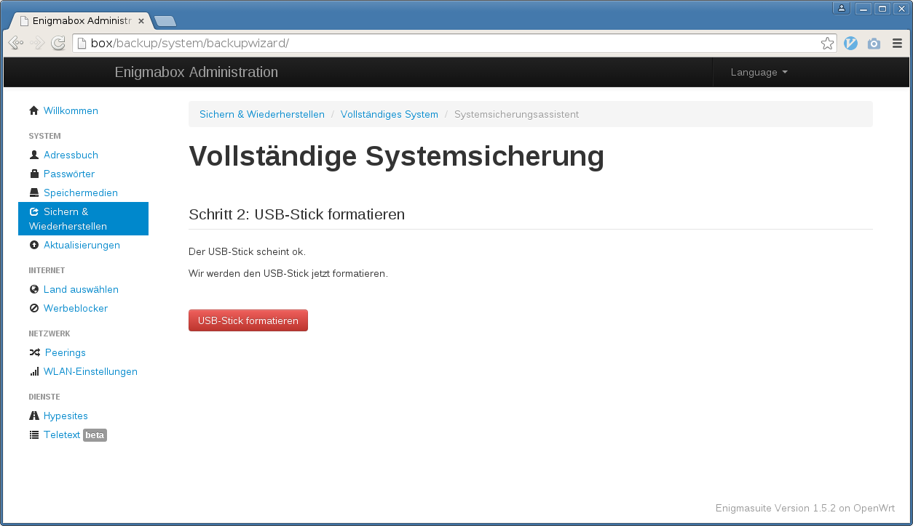

Formatiere den USB-Stick. ALLE DATEN AUF DEM STICK WERDEN ÜBERSCHRIEBEN!

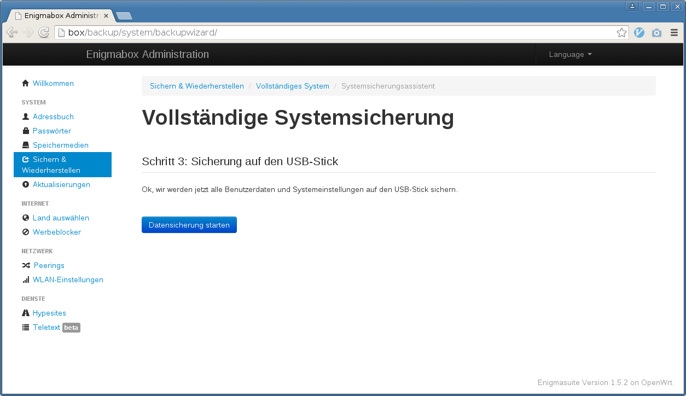

Starte die Sicherung.

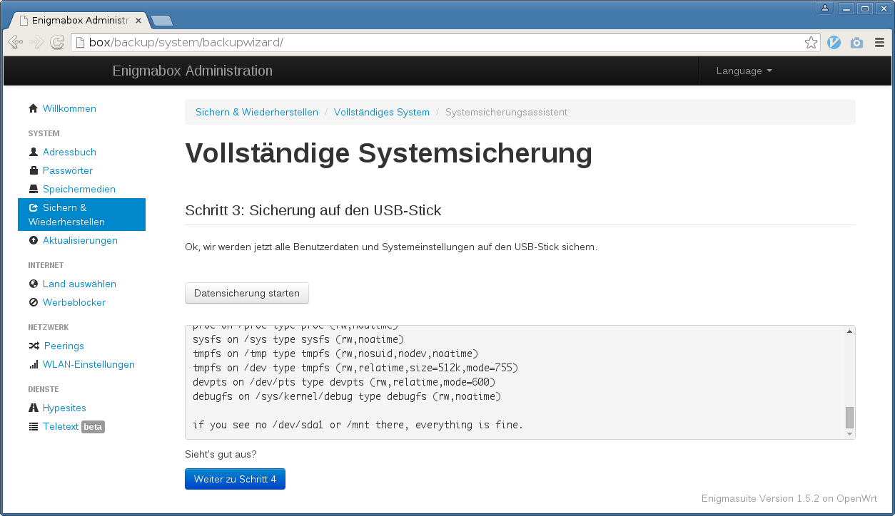

In einem kleinen Ausgabefenster kannst du den Fortschritt verfolgen. Am Schluss kommt die Meldung "*If you see no /dev/sdb1 or /mnt there, everything is fine.*" Prüfe in der in der Ausgabe gleich darüber, ob das auch so ist und fahre dann mit Schritt 4 fort.

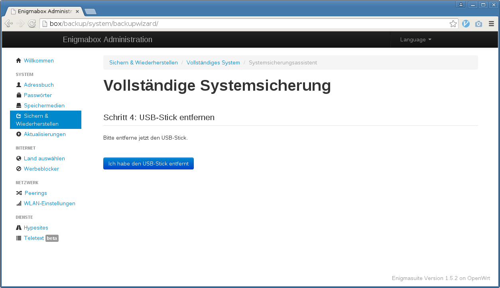

Entferne den USB-Stick. Du wirst dann zur Übersichtsseite weitergeleitet.

.. _restore:

***************************
Das System wiederherstellen
***************************

Klick im Menü "Sichern & Wiederherstellen" auf "Vollständiges System":

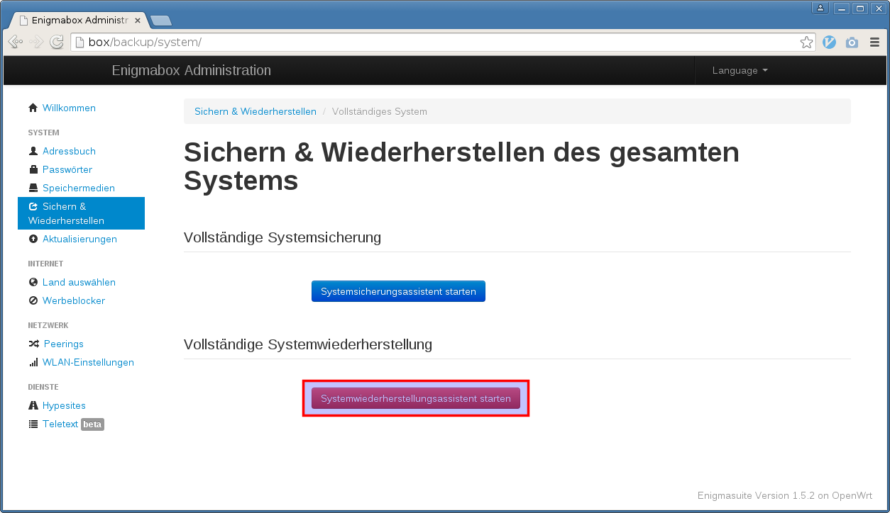

Starte den Systemwiederherstellungsassistenten.

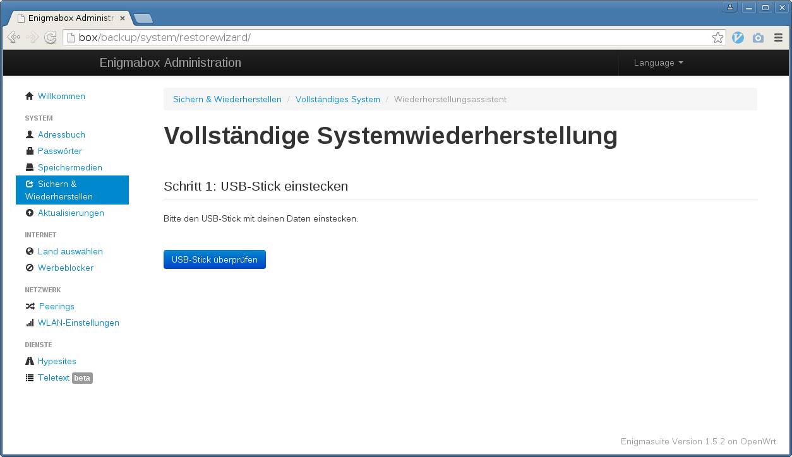

Stecke den USB-Stick ein. Er wird geprüft, ob daraus eine Systemwiederherstellung gemacht werden kann.

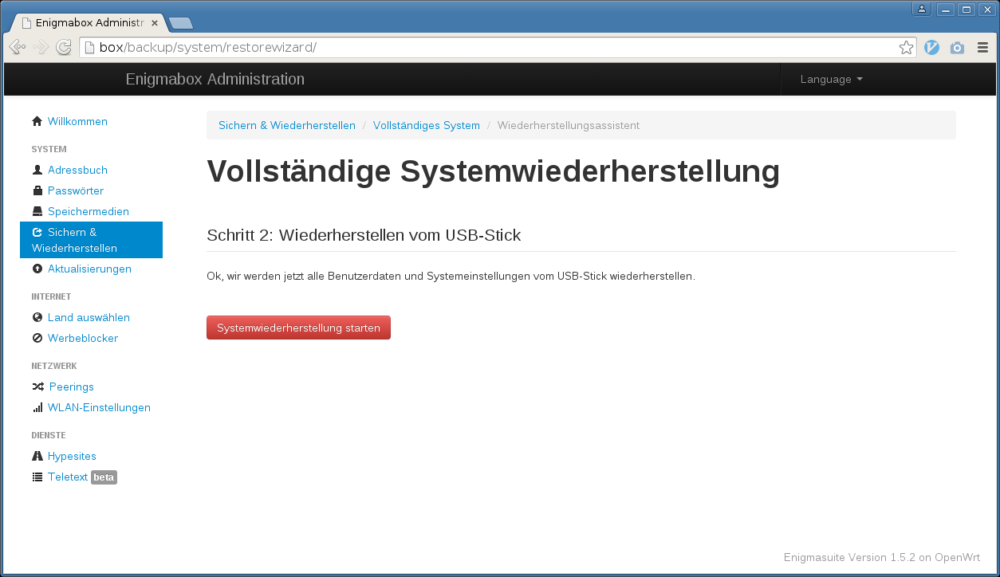

Starte die Wiederherstellung.

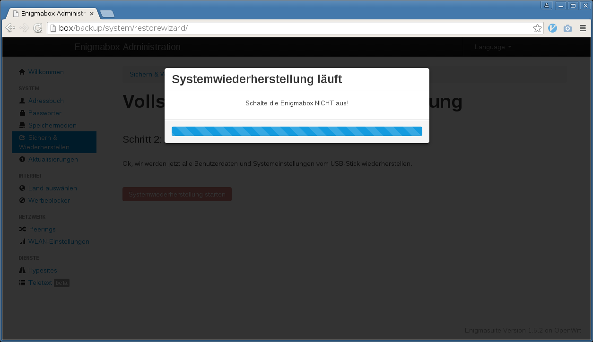

Der Prozess kann einige Minuten dauern. Stelle sicher, dass die Enigmabox mit dem Internet verbunden ist.

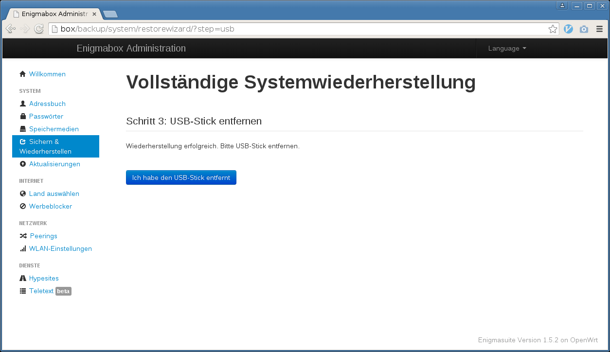

Entferne den USB-Stick. Du wirst dann zur Übersichtsseite weitergeleitet.

***************************
SSL-Zertifikate importieren
***************************

**Wichtig: Stelle sicher, dass die Enigmabox eine Internetverbindung hat!**

Klick im Menü "Sichern & Wiederherstellen" auf "SSL-Zertifikate":

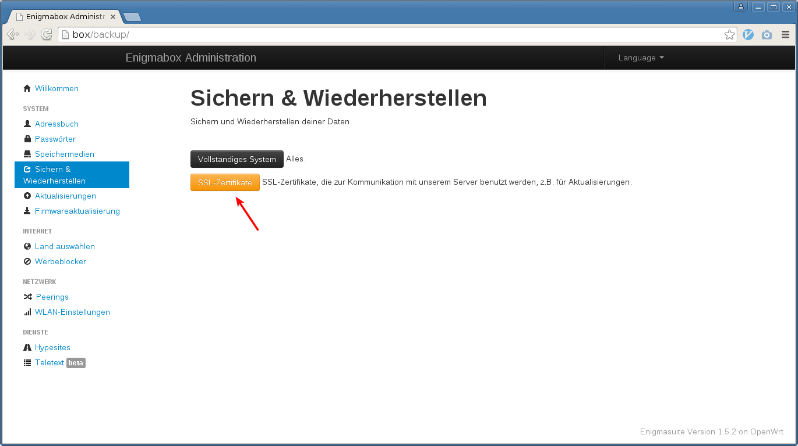

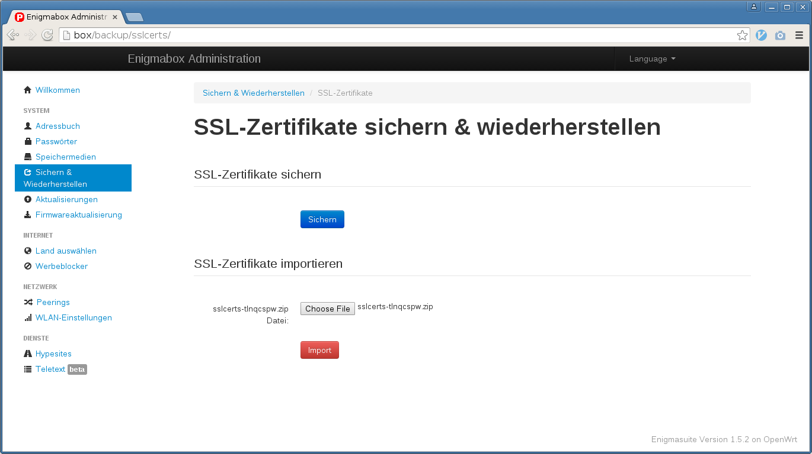

#. Wähle das SSL-Zertifikat aus
#. Klicke auf "Import"

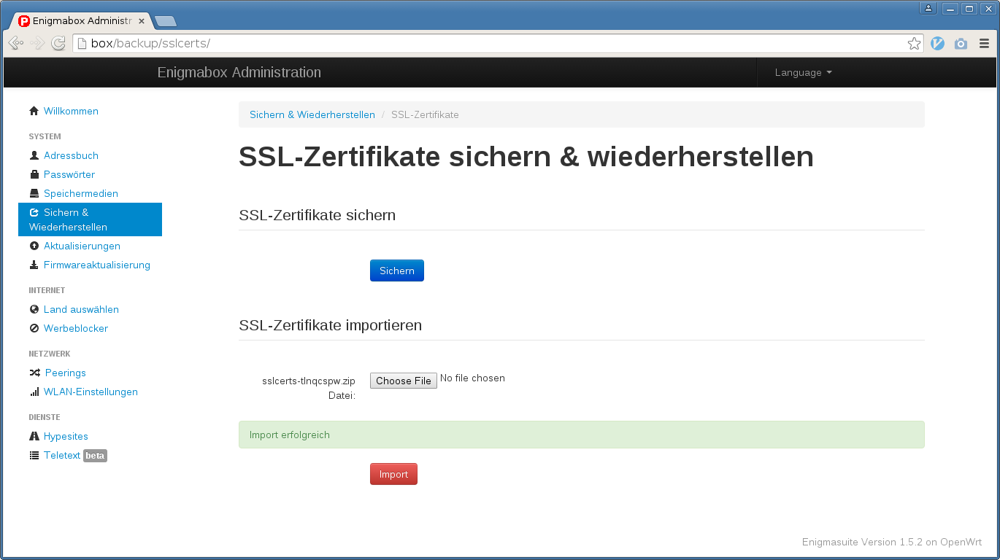

Wenn alles geklappt hat, wird die Meldung "Import erfolgreich" angezeigt.

Was passiert im Hintergrund?
============================

Die Enigmabox verbindet sich mit den SSL-Zertifikaten zum Administrationsserver, holt sich die Zugangsdaten zu den Servern und publiziert ihren *cjdns Public Key*, damit ihre IPv6 auf den Servern freigeschaltet wird und die verschlüsselte Internetverbindung aufgebaut werden kann.

**************************
Die Firmware aktualisieren
**************************

Die Firmwareaktualisierung schreibt das komplette Speicherabbild neu auf die Festplatte/Speicherkarte. Dabei werden E-Mails, Hypesites, /wiki und /owncloud gelöscht. Sichere dein System, bevor du die Firmwareaktualisierung machst (siehe :ref:`backup`)!

Die Firmwareaktualisierung eignet sich auch, um ein fehlerhaftes System auf den Originalzustand zurückzusetzen.

Schritt 1: Image herunterladen
==============================

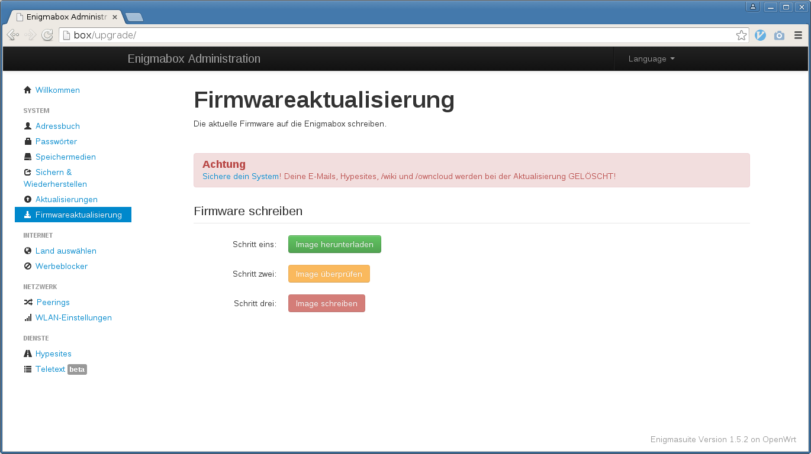

Lädt das neuste Firmwareimage vom Server herunter.

Schritt 2: Image überprüfen
===========================

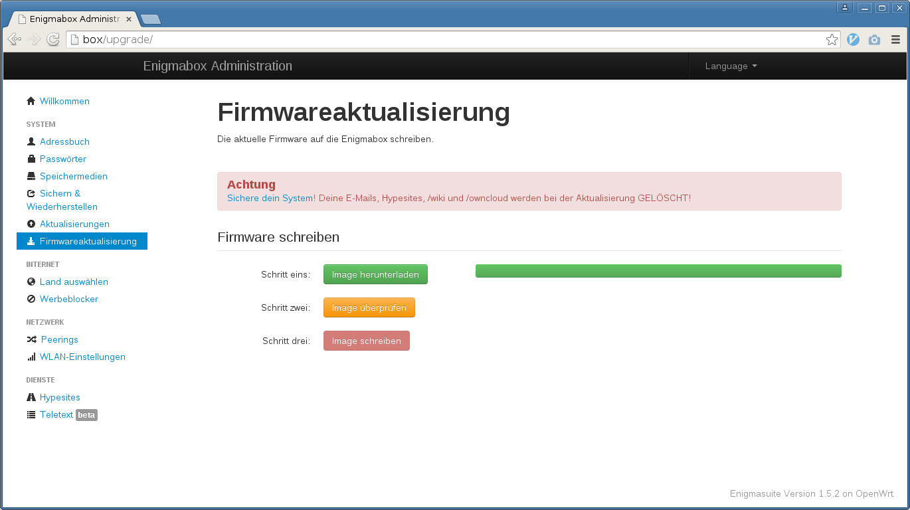

Überprüft, ob die Daten korrekt übertragen und unterwegs nicht manipuliert wurden.

Schritt 3: Image schreiben
==========================

Wenn alles in Ordnung ist, Image schreiben:

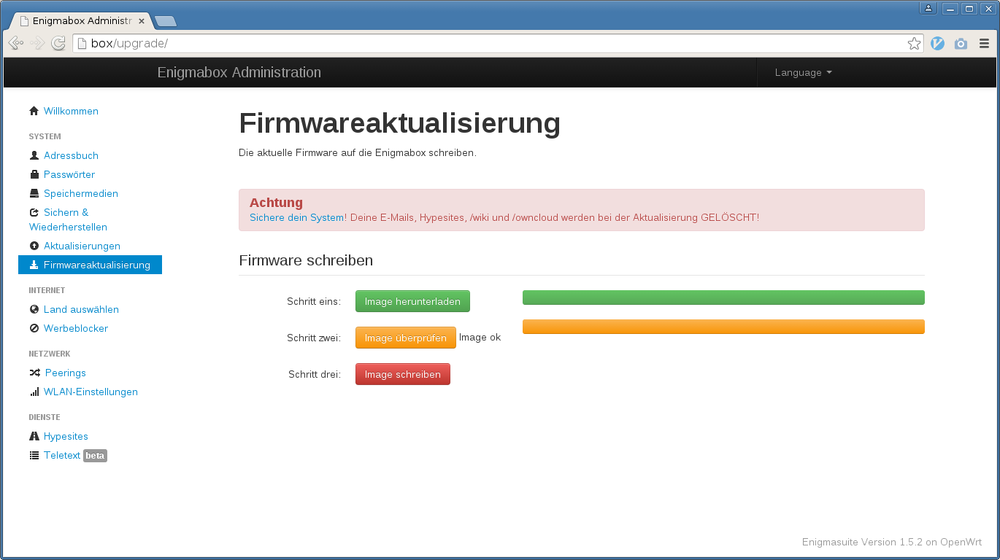

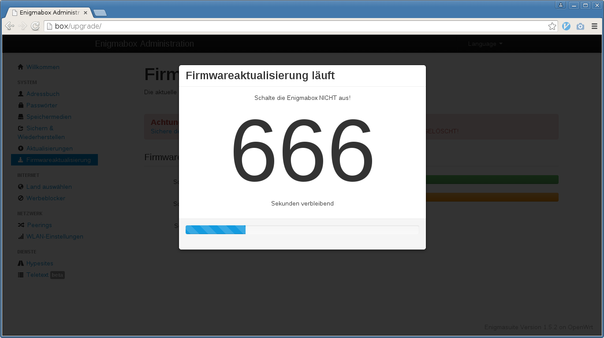

Der Prozess dauert eine Weile. Die Enigmabox startet nach dem Schreiben der Firmware neu und stellt die Grundeinstellungen wie IPv6, Passwörter und Konfigurationen wieder her. E-Mails, Hypesites, /wiki und /owncloud müssen allerdings über die Systemwiederherstellung wiederhergestellt werden (siehe :ref:`restore`).

