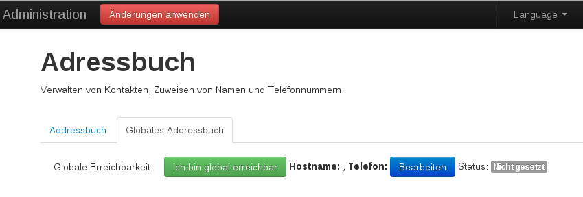

======
System
======

.. contents::
   :local:

.. _address_book:

*******************
Adressen verwalten
*******************

Das Adressbuch ist der Dreh- und Angelpunkt für die Kontaktverwaltung der Enigmabox. Die IPv6-Adresse wird zufällig generiert und dient als eindeutige Identifizierung im Netzwerk.

(Für technische Details, siehe :ref:`tech`).

.. image:: images/addressbook-1.png

Die IPv6 ist deine Telefonnummer. Die Enigmaboxen identifizieren sich nur anhand dieser IPv6.

Da es aber mühsam wäre, diese lange Folge von Zahlen und Buchstaben jedesmal am Telefon einzugeben, weist du der IPv6 eine Kurznummer für das Telefon, also eine Telefonnummer zu.

Kontakt hinzufügen
==================

.. image:: images/addressbook-add-number.png

Trage die IPv6 deines Kontakts (2) in das Feld "IPv6-Adresse" ein. Trage einen beliebigen Namen (Hostname) und eine Telefonnummer dazu ein.

Teile deine IPv6 (1) ("Meine Adresse") deinem Gegenüber mit. Er wiederholt den Vorgang.

Sobald die IPs gegenseitig im Adressbuch eingetragen sind, könnt ihr euch anrufen.

.. image:: images/addressbook-2contacts.png

Beispiel:

#. Meine IP ist "fccf:3286:feb2:cc8e:db0c:cf20:cc5d:e60"
#. Ich wähle die Telefonnummer "123"
#. Das Telefon ruft die IP "fc62:df23:6b65:2355:2efc:80b5:c0b9:7e11" (alexandra) an

Der Hostname (alexandra) wird für die E-Mail Adresse verwendet. Die E-Mail Adresse von alexandra ist in diesem Beispiel "mail@alexandra".

Wie man E-Mails sendet und empfängt, steht unter :ref:`email`.

**********************
Das globale Adressbuch
**********************

.. image:: images/global-addressbook.png

.. image:: images/ga-enter-number.png

.. image:: images/ga-pending.png

.. image:: images/ga-confirmed.png

.. image:: images/ga-rejected.png

.. _set_password:

*****************
Passwörter setzen
*****************

sdf

***********************
Passwörter zurücksetzen
***********************

sdf

.. _backup:

********************************
Eine Systemsicherung durchführen
********************************

sdf

***************************
Das System wiederherstellen
***************************

sdf

***************************
SSL-Zertifikate importieren
***************************

sdf

**************************
Die Firmware aktualisieren
**************************

sdf

