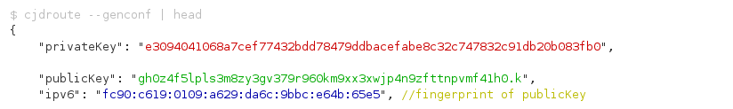

.. _tech:

=========================
Technische Funktionsweise
=========================

.. contents::
   :local:

*****
Cjdns
*****

Der Dreh- und Angelpunkt der Enigmabox ist deren Netzwerkprotokoll: cjdns. Die IP-Adresse kann hier nicht wie in traditionellen Netzwerksystemen frei gewählt werden, sondern sie wird zufallsgeneriert, mit einem dazugehörigen öffentlichen und privaten Schlüssel. Die Verschlüsselung fester Bestandteil des Protokolls. Die IPv6 ist der Fingerprint des öffentlichen Schlüssels. Niemand kann dir deine IP-Adresse wegschnappen, weil er den privaten Schlüssel nicht besitzt. Die IPv6 ist deine Identität.

Das hat ein paar Vorteile:

  * Zentrale Server, wo du deine Identität beweisen musst (zum Beispiel mit einem Passwort), entfallen.
  * Das erlaubt nicht nur eine dezentrale Infrastruktur, sondern eine verteilte Architektur.
  * Wenn die IPv6 deine Identität ist, ist sie deine E-Mail Adresse (mail@[ipv6]).
  * Wenn die IPv6 deine Identität ist, ist sie deine Telefonnummer (sip://[ipv6]).
  * Wenn die IPv6 deine Identität ist, ist sie dein Webserver (http://[ipv6]).
  * Siehst du, worauf es hinausläuft? Wir dezentralisieren das Internet.

So einfach ist das.

Cjdns fährt ein tun0 hoch und bindet die IPv6 daran. Sämtliche Anwendungen, die IPv6 unterstützen, können verschlüsselt kommunizieren. Wir müssen keine Anwendungen umbauen, wir brauchen keine Programme neu zu schreiben.

Cjdns verbindet sich zu Nachbarn (sog. Peers), wahlweise via WLAN, oder über einen UDP-Tunnel über das bestehende Internet. Die Routenfindung passiert automatisch.

******
System
******

Enigmabox - Ordnerstruktur
==========================

Was befindet sich wo auf der Enigmabox? Hier eine kleine Übersicht:

================================ =============================================================================
Ordner                           Beschreibung
================================ =============================================================================
/box                             Benutzerdaten
/box/settings.sqlite             Datenbank mit allen Einstellungen (IPv6-Adresse, Passwörter, Adressbuch, ...)
/etc/enigmabox                   Enigmabox-spezifische Konfigurationsdaten
/opt/enigmabox                   Enigmabox-Anwendungen
/opt/enigmabox/webinterface      Die Weboberfläche
/opt/enigmabox/cfengine-promises Systemkonfigurationsvorlagen
/srv/www                         HTML-Dokumente für Hypesites
================================ =============================================================================

Wie wendet die Enigmabox geänderte Systemeinstellungen an?
==========================================================

Die Enigmabox nutzt CFEngine zur Konfigurationsverwaltung. Machen wir ein Beispiel mit der */etc/hosts*-Datei und fügen eine Adresse im Adressbuch hinzu:

Ich füge die IPv6 *fc94:3931:6e5:859d:723f:f250:906f:27fb* mit dem Hostnamen *tester* und der Telefonnummer *1234* im Adressbuch hinzu.

**Einstellungen im Webinterface**

http://box/addressbook/ - das Interface zur Adresserfassung.

Die Option wird in der Benutzerdatenbank */box/settings.sqlite* in der Tabelle *address* gespeichert.

Wenn wir *cfengine-apply* aufrufen, passiert folgendes::

    root@box:~# cfengine-apply 
    running cfengine and applying promises...
      % Total    % Received % Xferd  Average Speed   Time    Time     Time  Current
                                     Dload  Upload   Total   Spent    Left  Speed
    100 29346    0 29346    0     0  66368      0 --:--:-- --:--:-- --:--:-- 66544
    2015-11-18T20:18:08+0000     info: /default/system_network/files/'/etc/hosts'[0]: Updated rendering of '/etc/hosts' from template mustache template '/opt/enigmabox/cfengine-promises/system_network/templates/hosts.mustache'
    2015-11-18T20:18:09+0000     info: /default/system_network/files/'/etc/enigmabox/display_names'[0]: Updated rendering of '/etc/enigmabox/display_names' from template mustache template '/opt/enigmabox/cfengine-promises/system_network/templates/display_names.mustache'
    2015-11-18T20:18:09+0000     info: /default/system_network/files/'/usr/sbin/rebuild-iptables'[0]: Updated rendering of '/usr/sbin/rebuild-iptables' from template mustache template '/opt/enigmabox/cfengine-promises/system_network/templates/rebuild-iptables.mustache'
    2015-11-18T20:18:09+0000     info: /default/system_network/commands/'/etc/init.d/dnsmasq restart'[0]: Executing 'no timeout' ... '/etc/init.d/dnsmasq restart'
    2015-11-18T20:18:09+0000     info: /default/system_network/commands/'/etc/init.d/dnsmasq restart'[0]: Completed execution of '/etc/init.d/dnsmasq restart'
    2015-11-18T20:18:09+0000     info: /default/system_network/commands/'/usr/sbin/rebuild-iptables'[0]: Executing 'no timeout' ... '/usr/sbin/rebuild-iptables'
    2015-11-18T20:18:09+0000     info: /default/system_network/commands/'/usr/sbin/rebuild-iptables'[0]: Completed execution of '/usr/sbin/rebuild-iptables'
    R: checking network configuration: done
    R: checking cjdns: done
    2015-11-18T20:18:10+0000     info: /default/app_telephony/files/'/etc/asterisk/sip.conf'[0]: Updated rendering of '/etc/asterisk/sip.conf' from template mustache template '/opt/enigmabox/cfengine-promises/app_telephony/templates/sip.conf.mustache'
    2015-11-18T20:18:10+0000     info: /default/app_telephony/files/'/etc/asterisk/extensions.conf'[0]: Updated rendering of '/etc/asterisk/extensions.conf' from template mustache template '/opt/enigmabox/cfengine-promises/app_telephony/templates/extensions.conf.mustache'
    2015-11-18T20:18:10+0000     info: /default/app_telephony/commands/'/etc/init.d/asterisk restart'[0]: Executing 'no timeout' ... '/etc/init.d/asterisk restart'
    2015-11-18T20:18:10+0000     info: /default/app_telephony/commands/'/etc/init.d/asterisk restart'[0]: Completed execution of '/etc/init.d/asterisk restart'
    R: checking telephony: done
    R: checking email: done
    R: checking webfilter: done
    R: checking security: done
    2015-11-18T20:18:11+0000     info: /default/app_hypesites/files/'/etc/lighttpd/hypesites.d/dokuwiki.conf'[0]: Updated rendering of '/etc/lighttpd/hypesites.d/dokuwiki.conf' from template mustache template '/opt/enigmabox/cfengine-promises/app_hypesites/templates/dokuwiki.conf.mustache'
    2015-11-18T20:18:11+0000     info: /default/app_hypesites/commands/'/etc/init.d/lighttpd restart'[0]: Executing 'no timeout' ... '/etc/init.d/lighttpd restart'
    2015-11-18T20:18:11+0000     info: /default/app_hypesites/commands/'/etc/init.d/lighttpd restart'[0]: Completed execution of '/etc/init.d/lighttpd restart'
    R: checking hypesites: done
    root@box:~# 

**cfengine-apply Skript**

Das *cfengine-apply* Skript:

  * Ruft die aktuelle Konfiguration über das Webinterface ab: http://box/cfengine/site.json
  * Speichert sie in der Datei */box/.cf-site.json*
  * Ruft cfengine auf mit der Datei */opt/enigmabox/cfengine-promises/site.cf* als Parameter

Die *site.cf*:

  * Liest die Konfiguration */box/.cf-site.json* ein
  * Wendet alle Vorlagen an

**CFEngine-Vorlage**

Die Vorlage sieht so aus:

/opt/enigmabox/cfengine-promises/system_network/templates/hosts.mustache::

    127.0.0.1           localhost
    ::1                 localhost ip6-localhost ip6-loopback
    fe00::0             ip6-localnet
    ff00::0             ip6-mcastprefix
    ff02::1             ip6-allnodes
    ff02::2             ip6-allrouters

    [...]

    # friends
    {{#addresses}}
    {{ipv6}}    {{hostname}}
    {{/addresses}}

    # global addresses
    {{#global_addresses}}
    {{ipv6}}    {{hostname}}.eb
    {{/global_addresses}}

**Systemkonfigurationsdatei**

Heraus kommt die berechnete Hosts-Datei:

/etc/hosts::

    127.0.0.1           localhost
    ::1                 localhost ip6-localhost ip6-loopback
    fe00::0             ip6-localnet
    ff00::0             ip6-mcastprefix
    ff02::1             ip6-allnodes
    ff02::2             ip6-allrouters

    [...]

    # friends
    fc94:3931:6e5:859d:723f:f250:906f:27fb    tester

    # global addresses
    fca4:7bc7:a85:2eec:138b:bed6:549f:fc72    rasterfahnder.eb
    fc38:2b91:7fbd:d9ea:dea0:52fc:e7f6:71a1    no-body.eb
    [...]

Dann werden alle betroffenen Dienste (dnsmasq, iptables, asterisk, ...) neugestartet.

Was alles neugestartet werden muss nach einem Template, das steht in der *bundle.cf*-Datei.

/opt/enigmabox/cfengine-promises/system_network/bundle.cf (vereinfacht)::

    bundle agent system_network
    {
      vars:
          "json"
          data => readjson("$(g.site)", 64000);

      files:
          "/etc/hosts"
          template_method => "mustache",
          template_data => readjson("$(g.site)", 64000),
          edit_template => "$(this.promise_dirname)/templates/hosts.mustache",
          edit_defaults => no_backup,
          classes => if_repaired("restart_dnsmasq");

          "/etc/dhcpd.conf"
          template_method => "mustache",
          template_data => readjson("$(g.site)", 64000),
          edit_template => "$(this.promise_dirname)/templates/dhcpd.conf.mustache",
          edit_defaults => no_backup,
          classes => if_repaired("restart_dhcpd");

      commands:
        restart_dnsmasq::
          "/etc/init.d/dnsmasq restart";

        restart_dhcpd::
          "/etc/init.d/dhcpd restart";
    }

Das ist die ganze Hexerei.

