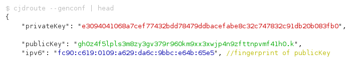

.. _tech:

=========================
Technische Funktionsweise
=========================

.. contents::
   :local:

*****
Cjdns
*****

Der Dreh- und Angelpunkt der Enigmabox ist deren Netzwerkprotokoll: cjdns. Die IP-Adresse kann hier nicht wie in traditionellen Netzwerksystemen frei gewählt werden, sondern sie wird zufallsgeneriert, mit einem dazugehörigen öffentlichen und privaten Schlüssel. Die Verschlüsselung fester Bestandteil des Protokolls. Die IPv6 ist der Fingerprint des öffentlichen Schlüssels. Niemand kann dir deine IP-Adresse wegschnappen, weil er den privaten Schlüssel nicht besitzt. Die IPv6 ist deine Identität.

Das hat ein paar Vorteile:

  * Zentrale Server, wo du deine Identität beweisen musst (zum Beispiel mit einem Passwort), entfallen.
  * Das erlaubt nicht nur eine dezentrale Infrastruktur, sondern eine verteilte Architektur.
  * Wenn die IPv6 deine Identität ist, ist sie deine E-Mail Adresse (mail@[ipv6]).
  * Wenn die IPv6 deine Identität ist, ist sie deine Telefonnummer (sip://[ipv6]).
  * Wenn die IPv6 deine Identität ist, ist sie dein Webserver (http://[ipv6]).
  * Siehst du, worauf es hinausläuft? Wir dezentralisieren das Internet.

So einfach ist das.

Cjdns fährt ein tun0 hoch und bindet die IPv6 daran. Sämtliche Anwendungen, die IPv6 unterstützen, können verschlüsselt kommunizieren. Wir müssen keine Anwendungen umbauen, wir brauchen keine Programme neu zu schreiben.

Cjdns verbindet sich zu Nachbarn (sog. Peers), wahlweise via WLAN, oder über einen UDP-Tunnel über das bestehende Internet. Die Routenfindung passiert automatisch.

******
System
******

  * Übersicht Ordnerstruktur
  * CFEngine
  * CF-Templates

