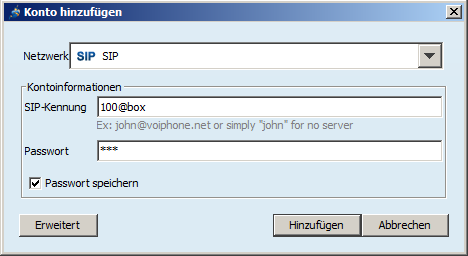
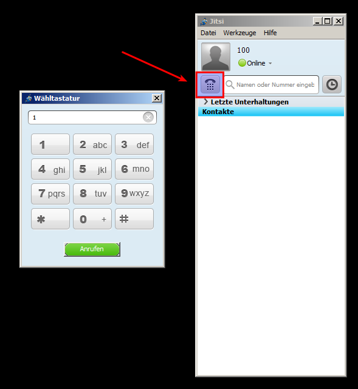
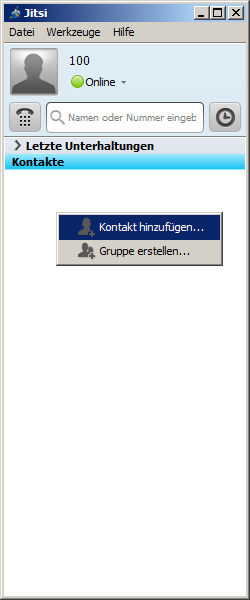
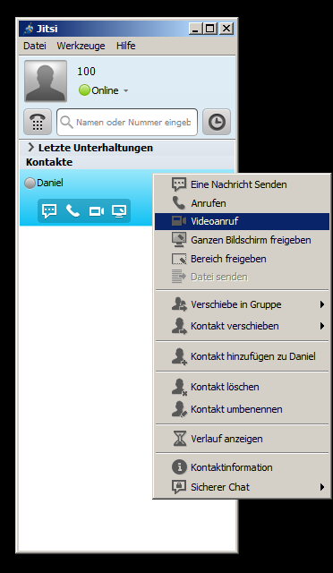
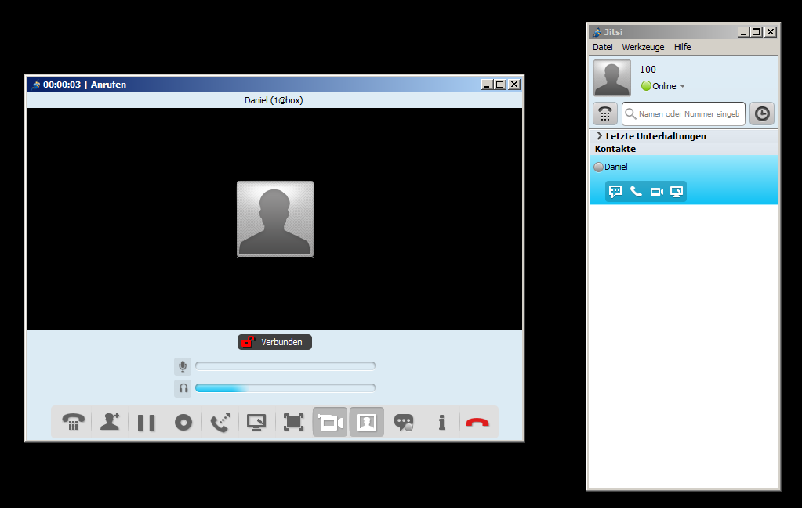
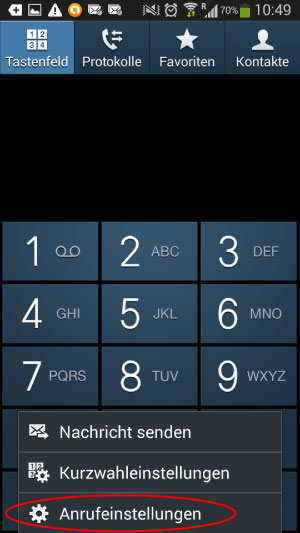
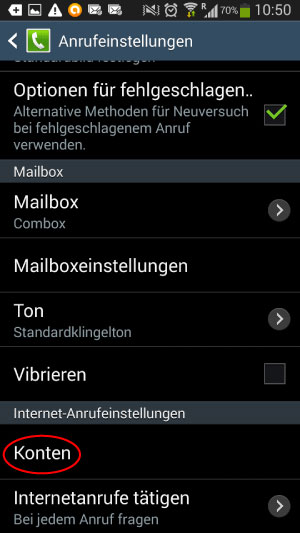
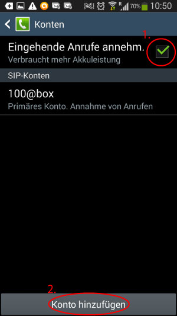
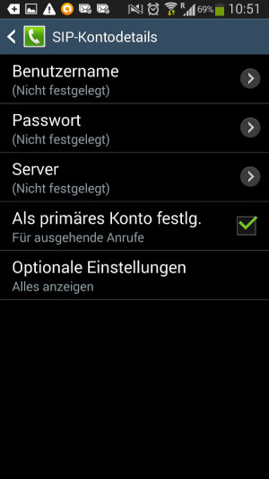

.. _telephony:

=========
Telefonie
=========

.. contents::
   :local:

**********************
Das Telefon einrichten
**********************

Verbinde das mitgelieferte Grandstream-Telefon mit der Enigmabox und warte ein paar Minuten. Das Telefon holt die Einstellungen von der Enigmabox und konfiguriert sich von alleine.

Für andere SIP-kompatible Telefone, hier die Verbindungsdaten für den Telefonserver:

| **Server:** box
| **Benutzer:** 100
| **Passwort:** 100
|

*************
Statusabfrage
*************

Die Telefonnummer "1" gibt Informationen zur Verbindung der Enigmabox, das Abo, erhaltene E-Mails und erreichbare Kontakte im Adressbuch aus.

.. _conference_calls:

******************
Telefonkonferenzen
******************

Telefonkonferenzen funktionieren heute meistens so, dass sich alle Teilnehmer in einen zentralen Server einwählen und danach wie in einem Sitzungszimmer miteinander reden können.

Nun - bei der Enigmabox gibt es keine solchen zentralen Server, die das ermöglichen. Deshalb haben wir ein wenig nachgedacht und sind zu folgendem Schluss gekommen:

**Jede Enigmabox ist ein Konferenzserver!**

Dem Konferenzraum auf deiner Enigmabox beitreten
================================================

Wähle die Nummer "8" auf dem Telefon. \*Dadü* - du bist in deinem Konferenzraum.

Einem Konferenzraum auf einer anderen Enigmabox beitreten
=========================================================

Bei jedem Anruf ertönt zuerst ein "du-diit"-Signalton. Du hast nun eine Sekunde Zeit, die Taste "8" zu betätigen - dann landest du im Konferenzraum der angerufenen Enigmabox.

Falls du nach dem Signalton nichts unternimmst, wird der Anruf normal durchgestellt und das Telefon klingelt.

So können sich ganz viele Teilnehmer in eine Enigmabox einwählen und dann eine Telefonkonferenz miteinander führen.

****************
Anrufbeantworter
****************

Der Anrufbeantworter springt automatisch an, wenn nach 30 Sekunden klingeln das Telefon nicht abgenommen wurde. Die aufgezeichnete Nachricht wird als E-Mail gespeichert und landet in der Inbox des Angerufenen.

.. _videocalls:

************************
Videotelefonie mit Jitsi
************************

Jitsi ist ein Softwaretelefon. Wenn du eine Webcam besitzt, ist alles vorbereitet für die verschlüsselte Videotelefonie!

Jitsi herunterladen
===================

Download von folgender URL: https://jitsi.org/Main/Download

Jitsi einrichten
================

Klicke auf "Datei/Konto hinzufügen...", um ein neues Konto zu erstellen:

Verwende *100@box* als SIP-Kennung, und *100* als Passwort:

Klicke auf "Hinzufügen".

Blende die Wähltastatur ein und rufe zum Test die Nummer 1 an.

Wenn alles geklappt hat, wirst du eine Stimme hören, die den Systemstatus vorliest.

Einen Kontakt hinzufügen
========================

Klicke mit der rechten Maustaste im Kontaktfeld und dann auf "Kontakt hinzufügen...".

Trage dort die Telefonnummer des Kontaktes ein, den du hinzufügen möchtest. Das ist die gleiche Telefonnummer wie im Enigmabox-Adressbuch. Vergib einen Namen.

Videoanruf starten
==================

Klicke mit der rechten Maustaste auf den neu hinzugefügten Kontakt, und dann auf "Videoanruf":

Der Videoanruf startet.

********************************************
Telefonie auf einem Android-Handy einrichten
********************************************

Stelle sicher, dass du die Enigmabox über WLAN erreichen kannst (Accesspoint muss am LAN-Anschluss der Enigmabox angeschlossen sein).

Tippe zuerst auf dem Home-Bildschirm des Android-Handys auf "Telefon":
  
.. image:: images/home.jpg

Tippe nun links unten auf dem Android-Handy auf die Menü-Taste:

Im sich darauf öffnenden Menü tippe auf "Anrufeinstellungen":

Scrolle im sich darauf öffnenden Einstellungsmenü ganz nach unten und tippe auf "Konten":

Im neu geöffneten Untermenü setze zuerst den Haken bei "Eingehende Anrufe annehmen" und tippe anschliessend auf "Konto hinzufügen":

Bei Benutzernamen und Passwort ist *100* einzugeben und der Server lautet *box*:

Die Einstellungen werden gespeichert, sobald du zum vorherigen Menü zurückkehrst. Dort wirst du zuunterst den Menüeintrag "Internetanrufe tätigen" finden. Tippe darauf und wähle die Option "Bei jedem Anruf fragen" aus.

Nun ist alles eingerichtet, Anrufe vom Android-Handy zu anderen Enigmaboxen tätigen zu können oder Anrufe von anderen auf deine Box mit dem Android-Handy entgegenzunehmen.

