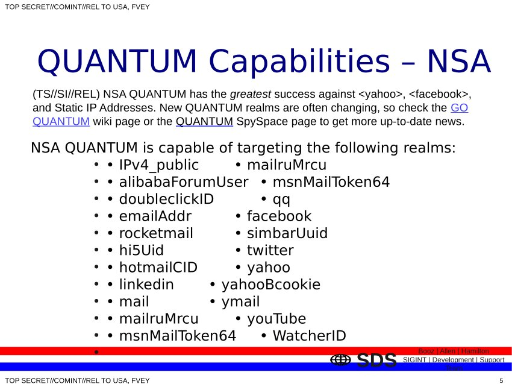
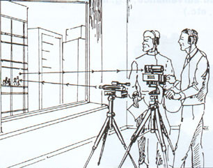
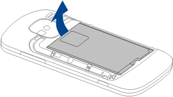

================
Bedrohungsmodell
================

.. contents::
   :local:

**************************
Unverschlüsselter Speicher
**************************

Der interne Speicher der Enigmabox (CF-Card, SD-Card, SSD) ist nicht verschlüsselt. Das muss noch implementiert werden.

Folgende Informationen sind exponiert im Falle einer Hausdurchsuchung:

* Adressbuch
* E-Mails
* cjdns Private Key
* Alle Passwörter
* OwnCloud-Dateien
* Wiki-Inhalte, Bilder
* Websites

**Abwehr:**

* Benutze Pseudonyme im Adressbuch für deine Kontakte.
* Richte einen Mailclient ein, damit möglichst wenig E-Mails auf der Box gespeichert werden (siehe :ref:`thunderbird` ).
* Im Falle einer Beschlagnahmung:
    * Benutz eine neue Enigmabox mit einer neuen IPv6.
    * INFORMIERE DEINE KONTAKTE, dass deine Box beschlagnahmt wurde und sie deine alte IPv6-Adresse aus dem Adressbuch löschen sollen. So wird den Behörden der Zugang verweigert.
    * Bestelle ein Ersatzzertifikat, schicke dein altes Zertifikat (Zip-Datei auf dem USB-Stick) an contact@enigmabox.net. Wir invalidieren es und stellen dir ein neues aus.

*******************************************
Kein Passwort gesetzt nach dem ersten Start
*******************************************

Das muss auch so sein für den ersten Start, damit du überhaupt auf die Administrationsoberfläche gelangst.

Setze sobald wie möglich ein Passwort für das Webinterface (siehe :ref:`set_password`).

**************************************
Benutzer verwendet schwache Passwörter
**************************************

Benutze starke Passwörter. Lass dir Zufallszeichen generieren. Unter Linux::

    tr -cd '[:alnum:]' < /dev/urandom | fold -w50 | head -n20

...mische selber noch eigene Zeichen rein. Benutze einen Passwortmanager, halte alles verschlüsselt.

******************************************************************
0day exploits (gewisse Dienste sind innerhalb des LANs erreichbar)
******************************************************************

Folgende Dienste sind vom LAN aus erreichbar:

* Webserver (Port 80 und 8080)
* Telefonserver (Port 5060)
* Mailserver (Port 25, 110 und 143)
* Proxyserver (Port 8888)

Diese Dienste können von Geräten angegriffen werden, die am "LAN"-Port der Enigmabox hängen. Wenn dort ein Switch hängt, alle Geräte am Switch. Wenn dort ein AccessPoint angeschlossen ist, alle Wlan-Geräte.

**Abwehr:**

* Benutze starke Passwörter
* Entscheide dich, für was du die Enigmabox einsetzen willst: Ein Internetcafe braucht nur Internet zur Verfügung zu stellen, keine Telefonie, keine E-Mails. Verwende eine separate Enigmabox in diesem Fall.
* Benutze einen Computer mit einem freien Betriebssystem, wo die Chance geringer ist, dass er mit einem Trojaner infiziert sein könnte.

*****************************************************************************
Benutzer benutzt Windows und besucht Malware-verseuchte Fuudibildli-Webseiten
*****************************************************************************

Wenn du eine Website besuchst, könnte sie Malware enthalten, die deinen Computer infiziert.

**Abwehr:**

* Benutz kein Windows
* Benutz nicht den Internet Explorer
* Besuche keine Webseiten, die möglicherweise Malware enthalten können, z.B. Pr0nsites, Downloadportale (mit vielen Bannern und "Zeugs"...)
* Benutz den eingebauten Webfilter (siehe :ref:`webfilter`)

**********************************************************************************************************************************
Benutzer loggt sich in Facebook ein. Netzwerkverkehr ist identifiziert, NSA lässt QUANTUM und FOXACID laufen und injiziert Malware
**********************************************************************************************************************************

http://sites.miis.edu/cyber/2013/10/08/quantum-and-foxacid-nsatao-mitming-tor-users/

* Wenn du dich auf Facebook anmeldest, oder auf Twitter, Linkedin, Gmail - *irgend* eine Seite, die nach einer Authentifizierung verlangt - sobald du eingeloggt bist, kann dein Netzwerkverkehr identifiziert und angegriffen werden.
* QUANTUM ist ein Server der NSA, der *schneller* als der Facebook-Server antwortet und dich zu einem FOXACID-Server umleitet.
* Der FOXACID-Server imitiert Facebook und jubelt dir lustige kleine Fernsteuerungsprogrämmli unter, die speziell auf deinen Computer zugeschnitten sind. Nur, dass am Ende nicht du deinen Computer fernsteuern kannst, sondern die NSA.

**Abwehr:**

* Die Enigmabox hilft dir, *IPv4_public* zu verschleiern
* Für alles andere bist du selber verantwortlich - melde dich nirgendwo an
* Benutz einen separaten Computer für die Konfiguration der Enigmabox - und benutz diese Box nur für Telefongespräche und E-Mails. Diese internen Dienste verlassen niemals das verschlüsselte Netzwerk.

***********************************************
Wanzen, andere Personen im Raum, Lasermikrofone
***********************************************

* Jemand hat eine Wanze in deinem Wohnzimmer installiert
* Ein Lasermikrofon zeichnet die Schwingungen an der Fensterscheibe auf
* Deine Nachbarn hören dich durch die Wände reden
* Umgehen so jede Verschlüsselung

**Abwehr:**

* Leg' dir ein Wanzenspürgerät zu und scanne dein Zimmer
* Rede leise
* Führe Telefongespräche in einem fensterlosen Raum

*******************************************
Eingeschaltete Mobiltelefone im selben Raum
*******************************************

Wir bekommen oft zu hören: "Ja aber, ist die Enigmabox sicher?"

Die verwendete Verschlüsselung und das Verfahren, dass für jede Verbindung Sitzungsschlüssel verwendet werden, die sich alle paar Minuten ändern und am Ende verworfen werden, machen die Enigmabox ziemlich ziemlich sicher. **Es nützt jedoch nichts, wenn daneben ein eingeschaltetes Mobiltelefon liegt.** Behörden können aus der Ferne das Mikrofon aktivieren und alles aufzeichnen, vorbei an jeder besten Verschlüsselung. Das funktioniert auch, wenn das Telefon "ausgeschaltet" ist (ist es nämlich nicht!).

**Abwehr:**

* Entferne die Batterien von *allen* Mobiltelefonen im Raum
* Besitze überhaupt kein Mobiltelefon; da dein Standort immer noch aufgezeichnet wird, unabhängig davon, ob das ein verschlüsseltes Mobiltelefon ist oder nicht.

