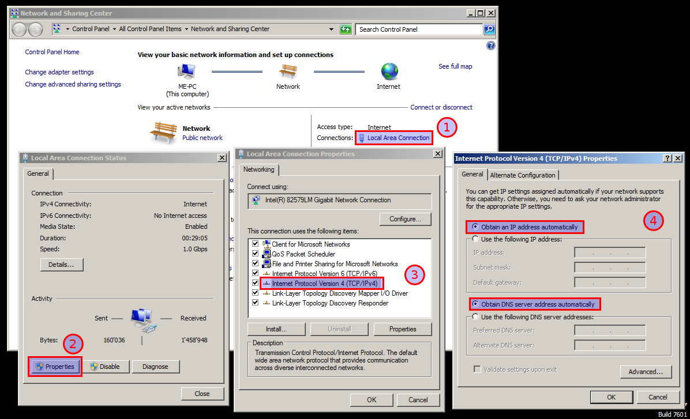

==============
Fehlerbehebung
==============

.. contents::
   :local:

Ich kann die Box nicht erreichen, was muss ich tun?
===================================================

Stelle sicher, dass die IP-Adresse automatisch zugewiesen wird:

Weitere Möglichkeiten, um auf das Webinterface zuzugreifen:

  * http://box.enigmabox.net
  * http://box/
  * http://enigma.box/
  * http://192.168.100.1 [#f1]_
  * http://192.168.101.1 [#f1]_

Sind die Kabel richtig angeschlossen? Siehe: :ref:`wiring`

.. [#f1] Je nach dem, welchen Bereich du eingestellt hast. Siehe: :ref:`lan_range`

Ich kann das Internet nicht erreichen
=====================================

Konntest du das Internet ohne die Enigmabox erreichen? Stelle sicher, dass dies der Fall ist.

Sind die Kabel richtig angeschlossen? Siehe: :ref:`wiring`

Was sagt das Telefon? Siehe: :ref:`status_phone`

Ich habe mein Passwort für das Webinterface vergessen
=====================================================

Du kannst es zurücksetzen, siehe: :ref:`reset_pw`

.. _status_phone:

Status via Telefon abfragen
===========================

Rufe auf die Telefonnummer 1 an, um den Systemstatus vorgelesen zu bekommen. Die Stimme liest folgendes vor:

  * Ob du E-Mails erhalten hast und wieviele
  * Ob alles ok ist
  * Das gewählte Land
  * Die Hostid
  * Wann das Abonnement abläuft
  * Wieviele Kontakte im Adressbuch erreichbar sind und wieviele nicht
  * Die installierte Softwareversion
  * Falls Netzwerkprobleme auftreten, wird ein detaillierter Statusbericht gegeben:

    * IP vom Router erhalten
    * Zugriff auf reguläres Internet
    * Netzwerkdienst (cjdns) läuft
    * Zugriff auf verschlüsseltes Internet

Mein Abonnement ist abgelaufen, was kann ich tun?
=================================================

Im Webinterface wird die Option eingeblendet, um es zu verlängern: http://box/subscription/

Lasse dir die Bankkontodaten anzeigen. Wichtig: Bei der Überweisung die Hostid angeben!

