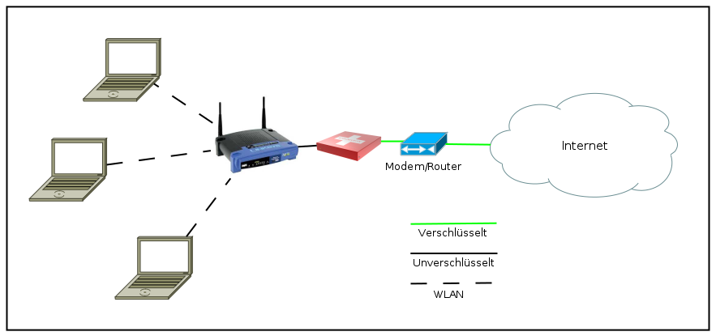
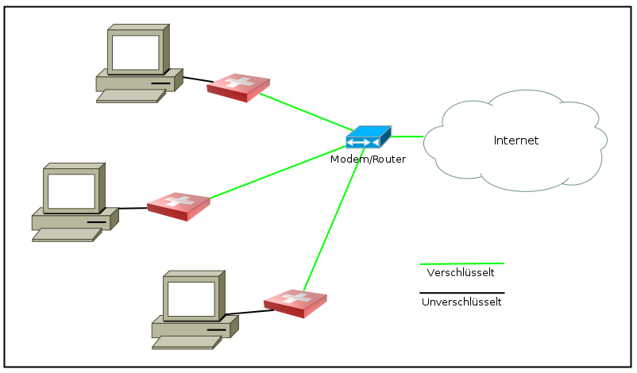
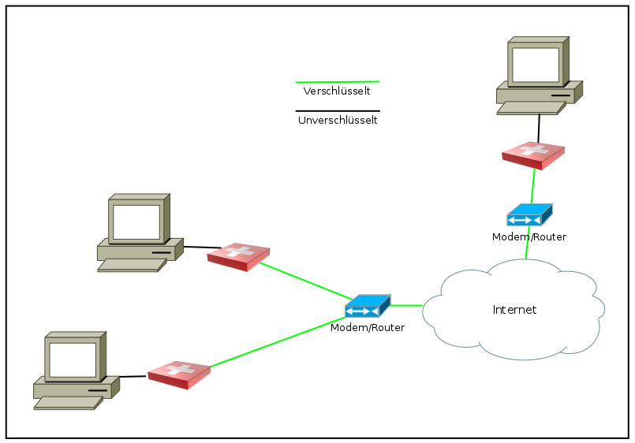

===============
Anwendungsfälle
===============

.. contents::
   :local:

****************
Als Heimanwender
****************

Heimanwender setzen ihre Enigmabox so ein:

.. image:: images/ebox-multi.png

Eine Enigmabox schützt das gesamte Netzwerk. Alle Rechner sind nach aussen abgeschirmt und können sicher surfen. Der Werbeblocker filtert Werbung (:ref:`webfilter`), die Abhörfunktionen von Windows 10 werden blockiert. Du umgehst Ländersperren auf YouTube mit der Länderwahl (:ref:`country_selection`).

****************
Als Internetcafe
****************

Besitzer eines Internetcafes oder eines sonstigen Anbieters von öffentlich zugänglichem Internet hängen die Enigmabox zwischen Router und Accesspoint:

Sie brauchen sich nicht um das Surfverhalten ihrer Gäste zu kümmern. Die Störerhaftung entfällt, sie tragen kein Risiko. Der Registrationszwang für die Gäste entfällt.

*********
Als Firma
*********

Kleine Firmen rüsten jeden Arbeitsplatz mit einer Enigmabox aus:

Und schon stehen sichere Computerarbeitsplätze mit verschlüsselter Telefonie bereit. Die Mitarbeiter sind untereinander vernetzt und können Dateien austauschen (:ref:`owncloud`), untereinander per E-Mail (:ref:`email`) und Telefon (:ref:`telephony`) kommunizieren, gemeinsam an Dokumenten arbeiten (:ref:`realtime_collaboration`) und Projekte bearbeiten (:ref:`wiki`). Telefonkonferenzen mit vielen Teilnehmern (:ref:`conference_calls`) sind ebenso möglich wie Videotelefonie (:ref:`videocalls`).

**************************
Als Diplomat, Anwalt, Arzt
**************************

Vertrauenspersonen schützen ihren Internetverkehr und ihre Infrastruktur. Falls ihre Kunden ebenfalls eine Enigmabox besitzen, können sie sich sicher mit ihnen darüber austauschen (:ref:`email`, :ref:`telephony`).

************
Als Forscher
************

Forscher und Wissenschaftler können an mehreren Standorten gemeinsam an Projekten (:ref:`wiki`) und Dokumenten (:ref:`realtime_collaboration`) arbeiten, sich per E-Mail austauschen (:ref:`email`), Telefonkonferenzen durchführen (:ref:`conference_calls`) oder sich gleich per Videotelefonie unterhalten (:ref:`videocalls`) und die Ergebnisse ihrer Arbeiten auf dem Webserver der Enigmabox hosten (:ref:`hosting`).
