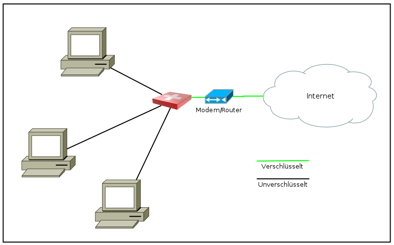

===============
Anwendungsfälle
===============

.. contents::
   :local:

****************
Als Heimanwender
****************

****************
Als Internetcafe
****************

Störerhaftung

*********
Als Firma
*********

.. image:: images/ebox-single.png

**************************
Als Diplomat, Anwalt, Arzt
**************************

Sicher surfen, Schutz der Infrastruktur, verschlüsselt mailen und telefonieren, Daten austauschen.

************
Als Forscher
************

.. image:: images/ebox-project.png

Projektergebnisse mit anderen teilen; an einer Forschungsarbeit kollaborativ arbeiten (Wiki, OwnCloud).
